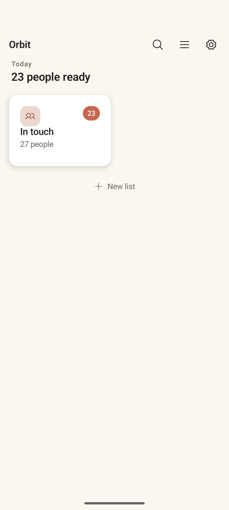
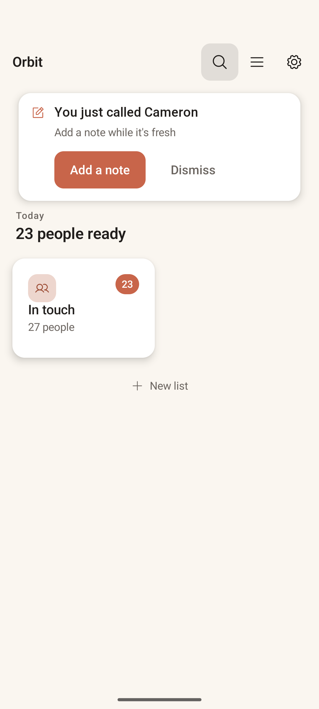

# Home

> **Intent** — The front door. Home exists to orient you in two seconds ("how many people are ready, in which lists?") and then get out of the way by launching you into the calling loop with the fewest possible taps. It is a launchpad, not a dashboard. It should never feel like a backlog or a to-do list demanding to be cleared.

**Mission tie** — This is the surface that decides whether the core loop even starts. Friction or guilt here means the loop never runs. Calm and one-tap-to-start is the whole job.

---

## Today

- App bar: wordmark **Orbit**, plus **Search**, **Lists**, **Settings** icons.
- A quiet date eyebrow (**Today**) over a count headline (**23 people ready**).
- One card per list: avatar tile, a terracotta **due-count badge** (`23`), list name, and total members (`27 people`). Tapping a card drops you straight into that list's Card View.
- A **New list** affordance below the cards.
- A contextual **post-call banner** appears after you place a call ("You just called Cameron · Add a note while it's fresh" with *Add a note* / *Dismiss*). This is a genuinely strong touch — it captures memory at the exact moment it's freshest.

What's missing is mostly *use of the space*: with one list, Home is ~80% empty, and there's no zero-friction "just give me someone" path.

---

## Where it's going

### `HOME-1` · Add "Surprise me" · **Now**
The voice doc already blesses "Surprise me" and "Pick for me" as affordances, but Home surfaces neither. Add a quiet **Surprise me** (Ghost-style, below the list cards) that opens a single random *due* person across all lists. This is the purest expression of the core value — zero deciding, one name — and it fills the empty canvas with something useful rather than decorative. It also gives people with one big list a reason to engage that isn't "work through the queue."

### `HOME-2` · A warm "caught up" zero-state · **Now**
We never want "0 people ready" to read as failure or an empty inbox. When nothing is due, Home should reassure in the house voice — *"You're caught up. Quiet is okay."* — not show a barren screen or, worse, nudge. This is a direct application of the "quiet is okay" principle and a guard against the app ever feeling like a chore.

### `HOME-3` · "Next up" peek on each list card · **Next**
Right now tapping a card is a blind jump — you don't know who you're about to get. Show the next person's first name + avatar on the card ("Next: Kai"). It makes the tap a *known* choice (lower friction, higher follow-through) and previews the payoff. Keep it to one name; this is a peek, not a list.

### `HOME-4` · Extend the post-call banner to non-calls · **Next**
The post-call banner is excellent — broaden it. After a call, offer *Add a note* **and** a quick *Mark how it went* (or simply confirm the connection). And consider surfacing a sibling banner when you tell the app you reached someone another way (see `CARD-4`). The banner is the app's best "capture while fresh" moment; lean into it.

### `HOME-5` · Make the empty canvas earn its keep · **Later**
With a single list, the lower two-thirds of Home is dead space. Long-term, this is room for one *quiet* ambient element — a one-line "today's rhythm" summary, or a soft generative motif tied to how many orbits you keep. The bar is high: it must stay calm and non-performative, never a stats widget or a streak. If in doubt, leave it empty — empty is on-brand.
