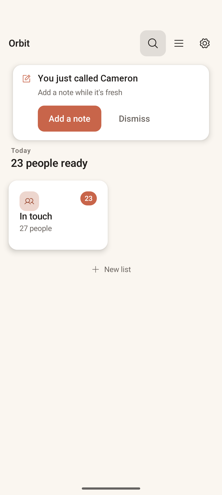
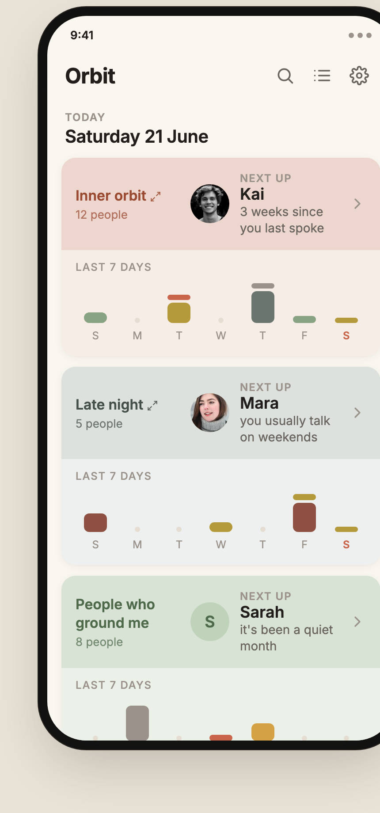
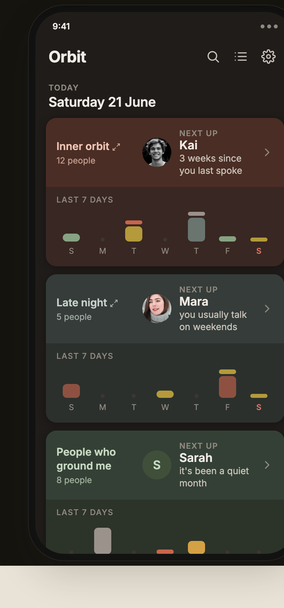
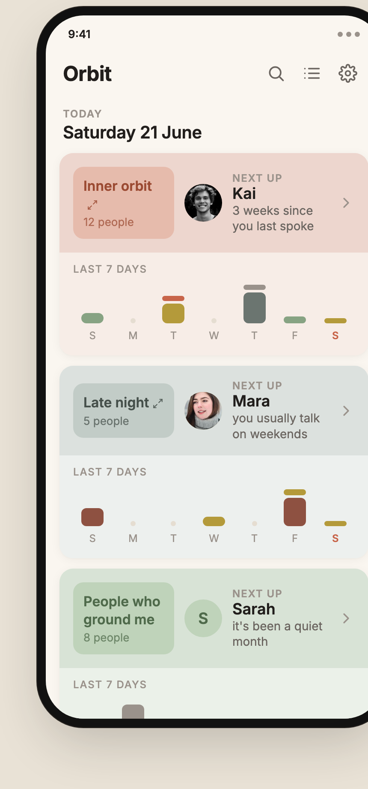

# Home

> **Intent**: The front door. Home exists to orient you in two seconds and then get out of the way by handing you *someone to call*. It is a launchpad, not a dashboard, and crucially it should **always have a recommendation**. There is no inbox to clear and no "you're done": the right framing is a person worth reaching, available at any moment. Home should never feel like a backlog, a to-do list, or a set of obligations coming due.

**Mission tie**: This is the surface that decides whether the core loop even starts. Friction or guilt here means the loop never runs. Calm, always-a-recommendation, one tap to start: that is the whole job.

---

## Today (as of 2026-10-05)

*First image: JVM gallery render (`PreviewGalleryTest`, Robolectric, light, 411dp, font scale 1.0) at `783a964`, 2026-10-05, not a device capture (`HomeScreen.HomeContentPreview`). Second: the June 2026 capture, kept because no Home preview carries the banner.*

- App bar: wordmark **Orbit**, then **Search**, **Lists** (a bulleted-list icon since 2026-10-05; the plain hamburger also meant "list options" on Card view) and **Settings**.
- A quiet eyebrow, **Today**, over the date (**Monday 5 October**). No count of people, no "ready", no "caught up": HOME-6 retired that vocabulary.
- One **full-width card per list** (HOME-5), in two tones: a tinted name block with the list's name and size ("12 people"), and a lighter wash beneath. The name block carries **Next up** (HOME-3): the person this list would surface first, with their face or initial, their first name, and a warm line on how long it has been ("3 weeks since you last spoke", "You haven't spoken yet"). A quiet, muted phone button ends the row: **Call Kai** opens the dialer in one tap (HOME-9); the rest of the card opens the list's deck.
- Under it, the **Last 7 days** rhythm strip (HOME-7, HOME-8): one stacked bar per call of three minutes or more, filled per person and rimmed per direction, with a "You / Them" key. Today's letter is bold; it was in the accent at `783a964` (the render above) and is ink from this round, so a Home with N lists no longer spends the screen's one accent N times (rules.md Design 5). A day with calls opens a sheet naming who you spoke to; a quiet day is inert.
- When a list has nobody to suggest, the row reads **All quiet for now**.
- A **New list** affordance below the cards, and the **reflection line** at the foot of the scroll.
- Long-press a card for **Quick actions**: Add people, List settings, Pause nudges or Resume nudges, then Archive and Delete (with Undo).
- After a call, a **post-call banner** offers "Add a note" or "Dismiss" (HOME-4).
- If the lists cannot be read: "Orbit couldn't load your lists", that nothing is lost, and **Try again** (HOME-10).

The redesign prototyped below shipped on 2026-06-22 (`7ba794e`) and the one-tap call on 2026-10-05 (`a961e2b`). What remains is polish: the card does not yet open into Card view as one motion (`ux-rubric.md` D5), and a one-list Home still has empty space below its single card (see HOME-5).

---

## Where it's going

### Design prototype

The moves below cohered into one redesigned Home: full-width cards, "Next up" on every card, no "due / caught up" language, and a per-card 7-day rhythm strip. Prototyped in [`prototype/`](./prototype/index.html) (open it in a browser; toggle variants and light/dark):

**Chosen: the two-tone card** (`design-twotone`), shipped in `7ba794e`. Each card's two tones (the A/B pair) derive from the active theme's accent and personality hues (`OrbitTones`, `DESIGN.md` "Tones derive"), so they follow a theme or the accent dial instead of being fixed terracotta. The chip variant (`design-chip`) was not taken. One difference from the prototype is deliberate: the app draws today's weekday letter in ink, not the accent (rules.md Design 5; the prototype's stylesheet says so at the rule).

### `HOME-3` · "Next up" on every list card · **Shipped 2026-06-22 (`7ba794e`)**
Tapping a card was a blind jump: you did not know who you were about to get. The head of that list's queue now sits on the card face: face, first name, and how long it has been. It turns the tap into a *known* choice (lower friction, higher follow-through) and previews the payoff. The data already existed: `SurfaceNextUseCase` computes exactly this head for Card view, and Home surfaces it one level up, so the two always agree. One name only, a peek rather than a list. Names mask under the privacy curtain (PRIV-03), like list names already did. With `HOME-6` it is what makes Home an always-on recommender.

### `HOME-6` · Retire the "due / caught up" framing · **Shipped 2026-06-22 (`7ba794e`)**
Home's job is to **always recommend someone to talk to**, not to count how many people are due, and never to announce that you are done. "Due", "N people ready" and "All caught up" were inbox-and-deadline vocabulary that fought the mission and the voice: deadlines breed the exact guilt the app refuses. Shipped as decided:
- **No "All caught up / Nobody is due" state.** Every card shows who is next, so there is nothing to catch up on; a list with nobody to suggest reads "All quiet for now".
- **The raw count is gone.** The header is calm orientation (**Today** and the date); the recommendation is the centrepiece.
- **The ranking stays, the deadline words go.** The queue still orders internally by `nextDueAt`; that is the engine choosing the best person to surface, invisible to the user.
- The open copy decision (does a quiet count survive?) was settled towards less: no count survives. The rule became explicit for every screen on 2026-10-05 (voice.md Never say: "due" as a deadline).

### `HOME-4` · Post-call "add a note" banner · **Shipped, kept narrow**
The banner captures memory at its freshest ("You just called Cameron · Add a note"). The earlier idea of *also* asking "mark how it went" was tried and **deliberately dropped** (commit `c22a5ce`: advance the card silently after a call, no Mark-it prompt): rating a call is exactly the performative friction the app avoids. One warm action, add a note, and nothing more.

### `HOME-5` · Make the quiet canvas earn its keep · **Shipped 2026-06-22 (`7ba794e`); one question open**
The 2-up grid left the lower two-thirds of Home empty with one or two lists. Home is now a **single column of full-width list cards**: list name and size on one line, the "Next up" person (`HOME-3`) given real estate, and the rhythm strip (`HOME-7`) beneath. It reads calmer, one thing at a time, echoing the one-at-a-time spirit of the core loop.

*Still open:* a one-list Home has one card and a long quiet canvas. The tradeoff recorded here (single column always, or fall back to a grid past N lists) was decided towards single-column; the one-list composition the rubric's plan item 2.1 mentions ("a composed layout when there is only one list") has not been designed. The **ReflectionFooter** stays at the foot of the scroll.

### `HOME-7` · A 7-day "rhythm" strip on each list card · **Shipped 2026-06-22 (`7ba794e`), within the guards below**
Under each card, a small 7-day graph of the list's connection rhythm: one bar per call you actually had that day, weighted by how long you spoke. The data all existed (`CallEventEntity` carries `occurredAt`, `durationSeconds`, `contactId`).

**This one needed care, because it runs straight at this doc's own spine.** The vision's through-line is *stats to context*; a 7-day graph of call count and duration is exactly the logistics we are trying to move away from, and "average calls made" on screen is one short step from a target, a score, a streak. Built literally, it would be a quantified-self dashboard. So it shipped **reframed as reflection, not performance**, and these guards hold:
- **Presence over metrics.** Who you connected with this week, not how many. Numbers stay quiet or absent on the card.
- **No targets, no averages-as-goals, no streaks.** No baseline is a bar to clear; nothing says "below average".
- **Duration as soft visual weight, not a printed number.** A fuller mark is a longer talk; the card never prints "37 min".
- **Subordinate to the mission filter.** If a glance at it ever produces guilt or a *should*, it has failed and comes out.

### `HOME-8` · The rhythm strip answers "who?" and "which way?" · **Shipped 2026-07-31**
`HOME-7` shipped as anonymous marks: a bar told you *that* a call happened and roughly how long, but not *who*. That is the half of the strip this doc asked for ("a memory of **who** you connected with this week"). `HOME-8` closes it.

**Tap a day: who you spoke to.** A bottom sheet lists that day's calls: face, name, direction, duration, time; each row taps through to the person. The strip stays the glance; the sheet is where names live, so the card surface gains no numbers.

**A direction rim on each bar.** Bar *fill* is the person (unchanged); a 2dp *rim* is the direction, one cool hue for calls you made, another for calls you received. Two channels, so neither reads as the other. The hues are semantic, not per-theme (`OrbitColors.directionOutgoing` / `directionIncoming`): a theme-derived direction colour would collide with Cool's blue and Plum's violet accents and vanish exactly where the cue is needed.

**Why this does not reintroduce the scoreboard.** Reciprocity is the one asymmetry a relationship app can honestly surface: "am I always the one calling?" is a question about *the relationship*, not a performance metric about the user. The guards:
- The two directions are drawn and named **symmetrically**: "You called" / "They called", same weight, same size. Never "you only made N".
- Counts appear **only inside the sheet the user opened on purpose**, never on the card surface. The glance stays wordless.
- **No ratio, no target, no "balance score", no streak.** The sheet counts one day and drops the empty half rather than printing a zero, so a one-sided day reads as a fact instead of a shortfall.

Same mission filter as `HOME-7`: if seeing the split ever produces guilt rather than a nudge to pick up the phone, the rim comes out and the sheet stays.

### `HOME-9` · One tap to a call · **Shipped 2026-10-05 (`a961e2b`)**
Home used to take three taps to reach a call: open the list, find the person, call. The "Next up" row now ends in a quiet, labelled phone button ("Call Kai") that opens the dialer for that person; the rest of the card still opens the list's deck. It replaced a chevron that only repeated that the card was tappable. Muted, not accent: rules.md Design 6 allows a quiet dial per person row, and the card keeps the screen's accent budget for the post-call banner's "Add a note" and the empty state's "Create your first list". Masked under the privacy curtain ("Call Someone"). The same pass gave Lists its own icon, stacked the name block and "Next up" at large text and on narrow cards so nothing clips, and made every day column a 48dp target on a 360dp phone. Spec: `features/home/README.md`, "One tap to a call".

### `HOME-10` · An honest error state · **Shipped 2026-10-05 (`49565af`)**
If the lists cannot be read, Home says "Orbit couldn't load your lists", that nothing is lost, and offers Try again, which re-subscribes. Before, a failed read ended the stream and Home sat on stale or empty chrome (`ux-rubric.md` D6; `features/home/README.md`, "Error state").

---

## Cut

- **`HOME-1` · "Surprise me"**: *tried and removed.* A random "just give me someone" button fought the model. Orbit recommends *intentionally* (the right person for now, ranked) and randomness undercut both trust in the recommendation and the warm, unhurried feel; it read as a slot machine. The always-on "Next up" (`HOME-3`) delivers the "zero deciding, one name" payoff without the gamble. ADR 0007, which specified it, is superseded.
- **`HOME-2` · Warm "caught up" zero-state**: *shipped, then retired* by `HOME-6`: in an always-recommend model there is no zero-state to soften, because there is no zero.

---

## Build note

Sourcing each card's "Next up" name looked like it would collide with **ADR 0006**, which made Home a single query (`HomeFeed`). It was settled in the build: `HomeFeed` enriches each list (`HomeFeed.enrichOne`) from the same member read `SurfaceNextUseCase` makes, so Room shares the query and Home and Card view cannot disagree about who is next; the denormalised `dueCount` column stays for the ranking. See `features/home/README.md`, Technical.
