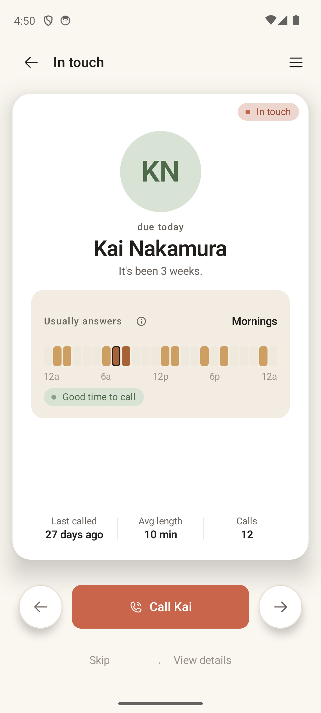
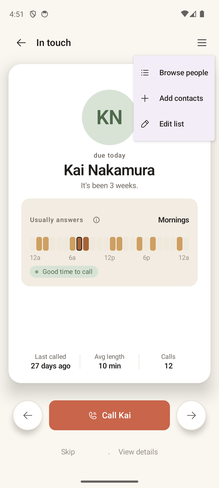

# Card View

> **Intent** — The heartbeat of the product. Card View exists to hand you exactly one person and answer a single question — *"is now a good time to reach them?"* — with just enough context that you can say yes (call) or not-yet (defer) without thinking hard. Everything about it should reduce the cognitive load of deciding *who*, and lower the activation energy of actually reaching out. If only one screen in Orbit is great, it has to be this one.

**Mission tie** — This *is* the mission. "One name at a time, with enough context to say yes." Every other screen is in service of making this moment good.

---

## Today

- A hero card: deterministic colour avatar, a **due eyebrow** ("due today" / "ahead of today"), the **name**, a **why-now** line ("It's been 2 months."), then either a **24-hour "usually answers" heatmap** (when history exists) or a **"No call history yet"** pill.
- A **stats row** at the card's foot: *Last called · Avg length · Calls*.
- Controls: a left **circle arrow** (Later), a primary **Call {firstName}** button, a right **circle arrow** (Sooner), and a text row **Skip · View details**.
- **Swipe** the card left = Later, right = Sooner; **tap the card** = call; the deck advances with a crossfade. A list-context chip sits top-right.
- The **List actions** menu (hamburger) offers *Browse people · Add contacts · Edit list*.

It's already a beautiful, focused screen. The gaps are about *context* and a couple of friction/clarity snags.

---

## Where it's going

> *Review pass — 2026-06-22 (Blaise). Decisions from that review are folded into the entries below: note truncation (`CARD-1`), idle hint over standing labels (`CARD-2`), text + in-person touchpoints (`CARD-4`), confirm-the-move snackbar (`CARD-5`), honest sync-window empty state (`CARD-6`), and the "deck has no bottom" reframe (`CARD-7`).*

### `CARD-1` · Put the last note / topic on the card face · **Now**
This is the single highest-leverage change in the whole app. Today the card shows logistics (last called, avg length, count) but hides the one thing that actually makes you pick up the phone: *what you last talked about.* The data already exists — notes are stored and even peeked *below* the card. Pull the most recent note up **onto** the card face, between the why-now line and the stats, as one quiet line: *"Last time: she just moved to Denver."* This is the literal definition of "enough context to say yes." Nearly free given the data is already there.

**Length** — clamp the on-card note to one or two lines and trail off with an ellipsis when it runs long; the full text already lives one tap away in *View details*. The card's whole worth is that it stays calm and bounded — an unbounded note would shove the heatmap and stats around and break the "one quiet line" it's meant to be. (Things 3 and Linear truncate previews exactly this way: a glance here, the full text on the detail screen.)

### `CARD-2` · Idle swipe hint, not standing labels + fix the asymmetry · **Now**
The two circle arrows are unlabeled forever after onboarding teaches them once — but printing permanent "Later" / "Sooner" captions adds standing chrome to a screen whose whole job is to stay quiet. Teach by *motion, only when it's needed.* If the card sits untouched for ~3 seconds, play one gentle hint — the card eases a few dp toward one side and settles back (or rocks slowly between both sides), telegraphing that it's swipeable, the way a game surfaces a control hint when a player stalls. It fires once on dwell, never loops, and stops the instant the user touches the card. Keep it inside the motion budget (≤250ms ease, no bounce past 5%) — a hint that twitches reads as anxious, not calm.

While here, fix a real inconsistency: the bottom text row says **"Skip · View details"**, but "Skip" maps to swipe-*left* (Later) while the right arrow is "Sooner" — the labels don't agree with each other. Reconcile the language so Later / Sooner / Skip mean one consistent thing everywhere on this screen.

### `CARD-3` · De-risk the accidental call · **Now**
The *entire* hero card is a tap-to-dial target, and a placed call can't be undone. (During this very review, a mis-tap near "View details" dialled a real person.) Make the labelled **Call** button the dialer, and let a full-card tap open **View details** instead — or add a light confirm. One-tap calling stays (via the clearly-labelled button); the foot-gun goes away. This is a safety fix, not a friction add.

### `CARD-4` · "Reached them another way" — text and in-person, not just a call · **Next**
Calling isn't the only way people stay in touch, and the rhythm engine shouldn't treat the others as silence. Today a phone call is the *only* completion that satisfies the cadence, so texting someone — or seeing them in person — looks identical to ghosting them. Make both first-class: a small **"Reached another way"** action that records the touchpoint as a **text** or an **in-person** meet (reusing the existing *Log a connection* path) and then advances the deck exactly as a call would. Each counts as real contact for the cadence and the "it's been 3 weeks" line. This is what widens Orbit from "a calling app" to "a staying-in-touch app" without diluting the one-name-at-a-time loop.

### `CARD-5` · Confirm the move the moment you make it · **Next**
When you defer or pull someone sooner — even on a light swipe — you want a half-second of "got it, here's what happened" before the deck moves on. This is very doable with the standard pattern, and most of it is already wired: a defer/sooner raises a Material **snackbar** with **Undo** and a plain-language line (*"Deferred — back in 3 weeks"*, *"Moved up — due tomorrow"* — see `CardViewViewModel.kt`). The work left is making sure it fires on the lighter swipe too and reads warmly.

On phrasing — prefer the *when* ("comes back up in about 2 weeks") over a raw list position ("moved 23 down"). A position number is technically possible, but the queue re-orders continuously as other people come due (see `CARD-7`), so a fixed slot would be both unstable and faintly gamified; the time framing is warmer, steadier, and already on-voice. The **Undo** doubles as the safety net for a mis-swipe, which dovetails with `CARD-3`.

### `CARD-6` · Tell the truth about the empty heatmap · **Next**
"No call history yet" isn't quite true and reads like a dead end in the middle of the card. The app only imports the call log for a bounded window — today the **last 90 days**, and it's user-adjustable (`callLogImportDays`) — so an empty heatmap almost always means *nothing in that window*, not that you've never spoken. Say exactly that: **"No calls in the last 90 days."** Track the configured value so the number is always honest. It's more accurate, it quietly explains *why* the heatmap is blank, and it sidesteps the forbidden "you haven't called…" shame framing entirely by pointing at the data window rather than at the user. Only when we can *positively* tell a relationship is brand new (e.g. the contact was added in-app after the last sync) does a neutral *"First call — nothing logged yet"* earn its place; absent that evidence, don't claim "first" — the window line is the safe default.

### `CARD-7` · The deck has no bottom — order it by "who's most likely to pick up now" · **Later → rethink**
The earlier idea here — a faint *"·· of 23"* position cue — quietly assumes the deck is a *list with an end* you work down. It isn't. There's no bottom: deciding on someone just moves their card to *some later point in the same revolving queue.* So a count ("12 left") is the wrong mental model and risks turning a calm loop into something to grind down. Drop the counter.

The signal that actually matters isn't *how many are left* — it's *who's on top, and why them.* For a list of people you talk to often, the top card should be **whoever is most likely to answer right this minute**, read off the same when-they-usually-answer history that already powers the "Usually answers / Good time to call" heatmap. The promise becomes "the person in front of you is the best one to call right now," not "you have N to get through."

This also surfaces a product-level fork worth naming: a list can serve **two different intents** — *staying close to friends, old and new* (cadence-driven — surface whoever you're quietly drifting from) versus *reaching into your network for people who can help* (opportunity-driven — surface whoever is most reachable and most relevant right now). Those want different orderings, so this is bigger than a card cue; it likely belongs in list configuration and the mission framing too. Flagged here, not silently expanded → see `README` / `07-list-config`.

### `CARD-8` · A gentle conversation prompt · **Later**
When there's an occasion or a hook (a birthday, a note that mentions an upcoming trip), offer a soft opener line. This is the natural extension of `CARD-1`: not just *why now*, but *what to open with* — the deepest possible answer to "give me enough to say yes."
