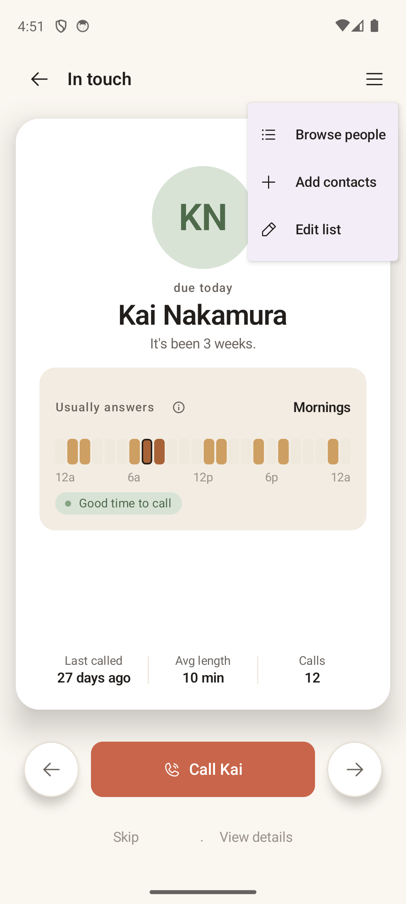

# Card View

> **Intent**: The heartbeat of the product. Card View exists to hand you exactly one person and answer a single question, *"is now a good time to reach them?"*, with just enough context that you can say yes (call) or not yet (Later) without thinking hard. Everything about it should reduce the cognitive load of deciding *who*, and lower the activation energy of actually reaching out. If only one screen in Orbit is great, it has to be this one.

**Mission tie**: This *is* the mission. "One name at a time, with enough context to say yes." Every other screen is in service of making this moment good.

---

## Today (as of 2026-10-05)

*First image: JVM gallery render (`PreviewGalleryTest`, Robolectric, light, 411dp, font scale 1.0) at `783a964`, 2026-10-05, not a device capture (`CardViewScreen.CardViewContentPreview`). Second: the June 2026 capture.*

- App bar: back, the list's name, and a **three-dots** button ("More actions for Inner orbit") opening *Browse people · Add people · List settings*, the same words as Home's long-press menu. (It was a hamburger that read "List actions", with "Add contacts" and "Edit list".)
- The hero card: a list chip, the face (photo or initials), a small eyebrow over the name (**Up now** or **Coming up**; "Due today" / "Not due yet" until this round, voice.md Never say), the **name**, then why now in human terms (CARD-04): when you last spoke ("You spoke 11 days ago."; "It's been 11 days." until this round, then briefly "11 days since you last spoke.", the "N days since" framing voice.md never says), the pair's usual rhythm once there are four calls ("You usually talk about every 2 weeks.", the median gap, a fact, never a deadline), and the **most recent note**, quoted, with when you wrote it. Then the **Usually answers** 24-hour strip with "Good time to call", or a plain line when there is not enough history for a pattern.
- A **stats row** at the card's foot: *Last call · Average length · Total calls* ("Calls" in the render; one name per stat from this round, voice.md). No "Avg".
- Controls: **Later** and **Sooner**, named on screen and to TalkBack (CARD-02), either side of the one accent button, **Call Avery** (CARD-01). Beneath them a single text row, **Open details** ("View details" in the render; it and a tap on the card face do the same thing). "Skip" is gone.
- **Swipe** left for Later, right for Sooner. Each shows a snackbar naming the person and when they come back ("Avery will come up again in 2 weeks.", "Avery comes up tomorrow.") with an Undo that can only revert its own action; a newer snackbar replaces an older one. **Only Call dials**; after a call the log confirms, "Called Avery" with "Add a note" (CARD-03). The deck moves on by itself once the call log shows the call (CORE-04, a product decision kept on purpose).
- Empty states: "No one is in this list yet." with Add people; "All quiet for now." with who comes up next and when (CARD-05). A failed read is an error with Try again, not a crash (CARD-07, this round).
- In landscape the card sits left with its actions in a column on the right; above 130% text, Call takes its own row (CARD-06). Under the privacy curtain the name reads "Contact" and the note is hidden.

The screen is now what this file asked for in June. The remaining moves are about widening what counts as contact (`CARD-4`) and the deck's ordering (`CARD-7`).

---

## Where it's going

> *Review pass 2026-06-22 (Blaise). Decisions from that review are folded into the entries below: note truncation (`CARD-1`), idle hint over standing labels (`CARD-2`, since superseded), text and in-person touchpoints (`CARD-4`), confirm-the-move snackbar (`CARD-5`), honest sync-window empty state (`CARD-6`), and the "deck has no bottom" reframe (`CARD-7`).*

### `CARD-1` · Put the last note / topic on the card face · **Shipped 2026-10-05 as CARD-04 (`468d68d`)**
The single highest-leverage change in the whole app. The card showed logistics (last called, average length, count) but hid the one thing that makes you pick up the phone: *what you last talked about.* The most recent note from the last 30 days now sits **on** the card face, quoted, between the why-now lines and the stats, with when you wrote it. This is the literal definition of "enough context to say yes."

**Length**: the on-card note is clamped and trails off when it runs long; the full text lives one tap away in Open details. The card's whole worth is that it stays calm and bounded. (Things 3 and Linear truncate previews exactly this way.) The note is hidden under the privacy curtain.

### `CARD-2` · Idle swipe hint, not standing labels · **Superseded 2026-10-05**
This entry proposed removing the "Later" / "Sooner" captions and teaching the swipe by a one-time idle motion. Both halves were decided the other way:
- **The labels stay.** Every control carries a visible name and a TalkBack name (`ux-rubric.md` gate G2, CARD-02). Unlabelled arrows failed the accessibility floor, whatever onboarding had taught.
- **No idle motion.** rules.md Design 8 forbids motion on idle surfaces (CORE-09), and a card that stirs when you stall reads as anxious, not calm. *Revisited 2026-10-07:* reviewing the prototype, the owner asked for hints that fade in and out to teach the swipe, so the card now has them (CARD-09), as a bounded exception: the card never moves, two labels ("Later · Thursday", "Sooner · Tomorrow") fade in at its top corners after four untouched seconds, at most three times for a person, and never again once five moves are made. The labels on the buttons stay.
- **The asymmetry is fixed.** The bottom row read "Skip · View details" while the arrows said Later and Sooner. "Skip" is removed; Later and Sooner are the two words everywhere (voice.md glossary, `X-5`).

### `CARD-3` · De-risk the accidental call · **Shipped 2026-10-05 as CARD-01 (`468d68d`)**
The *entire* hero card was a tap-to-dial target, and a placed call cannot be undone (during the June review a mis-tap near "View details" dialled a real person). The labelled **Call** button is now the only thing that dials, and a tap on the card opens details. One-tap calling stays; the foot-gun is gone. A safety fix, not a friction add; `ux-rubric.md` decision 3.

### `CARD-4` · "Reached them another way": text and in-person, not just a call · **Next**
Calling is not the only way people stay in touch, and the rhythm engine should not treat the others as silence. Today a phone call is the *only* completion that satisfies the rhythm, so texting someone, or seeing them in person, looks identical to ghosting them. Make both first-class: a small **"Reached another way"** action that records the touchpoint as a **text** or an **in-person** meet (reusing the existing *Log a connection* path, which already distinguishes "We connected" from "Couldn't reach them") and then advances the deck exactly as a call would. Each counts as real contact for the rhythm and the "It's been 3 weeks" line. This is what widens Orbit from "a calling app" to "a staying-in-touch app" without diluting the one-name-at-a-time loop.

### `CARD-5` · Confirm the move the moment you make it · **Shipped 2026-10-05 as CARD-02 (`468d68d`)**
When you move someone, even on a light swipe, you want a half-second of "got it, here's what happened" before the deck moves on. Every Later and Sooner now raises a snackbar with **Undo** and a plain-language line that names the person and the *when* ("Sarah will come up again tomorrow.", "Sarah comes up in 2 weeks."), never a raw list position: the queue re-orders continuously as other people come up (see `CARD-7`), so a fixed slot would be unstable and faintly gamified. Each snackbar carries its own undo token, so Undo on the first of three quick swipes can no longer revert the third person. The **Undo** doubles as the safety net for a mis-swipe, which dovetails with `CARD-3`.

### `CARD-6` · Tell the truth about the empty heatmap · **Resolved 2026-10-05**
"No call history yet" was not quite true next to "Total calls 2" and read like a dead end. The strip's empty line now says that there are **not enough calls yet to see a pattern**, which is true with one or two calls and points at the data rather than at the user, so the forbidden "you haven't called…" framing never arises. The window wording proposed here ("No calls in the last 90 days") was not taken: the strip's floor is a count of calls, not a span of days, so a day count would have been the wrong explanation.

### `CARD-7` · The deck has no bottom: order it by "who's most likely to pick up now" · **Later, rethink**
The earlier idea here, a faint *"·· of 23"* position cue, quietly assumes the deck is a *list with an end* you work down. It is not. There is no bottom: deciding on someone moves their card to *some later point in the same revolving queue.* So a count ("12 left") is the wrong mental model and risks turning a calm loop into something to grind down. Drop the counter.

The signal that matters is not *how many are left* but *who is on top, and why them.* For a list of people you talk to often, the top card should be **whoever is most likely to answer right this minute**, read off the same when-they-usually-answer history that already powers the "Usually answers / Good time to call" strip. The promise becomes "the person in front of you is the best one to call right now," not "you have N to get through."

This also surfaces a product-level fork worth naming: a list can serve **two different intents**, *staying close to friends, old and new* (rhythm-driven: surface whoever you are quietly drifting from) versus *reaching into your network for people who can help* (opportunity-driven: surface whoever is most reachable and most relevant right now). Those want different orderings, so this is bigger than a card cue; it likely belongs in list configuration and the mission framing too. Flagged here, not silently expanded: see `README` and `07-list-config`.

### `CARD-8` · A gentle conversation prompt · **Later**
When there is an occasion or a hook (a birthday, a note that mentions an upcoming trip), offer a soft opener line. The natural extension of `CARD-1`: not just *why now*, but *what to open with*, the deepest possible answer to "give me enough to say yes."
