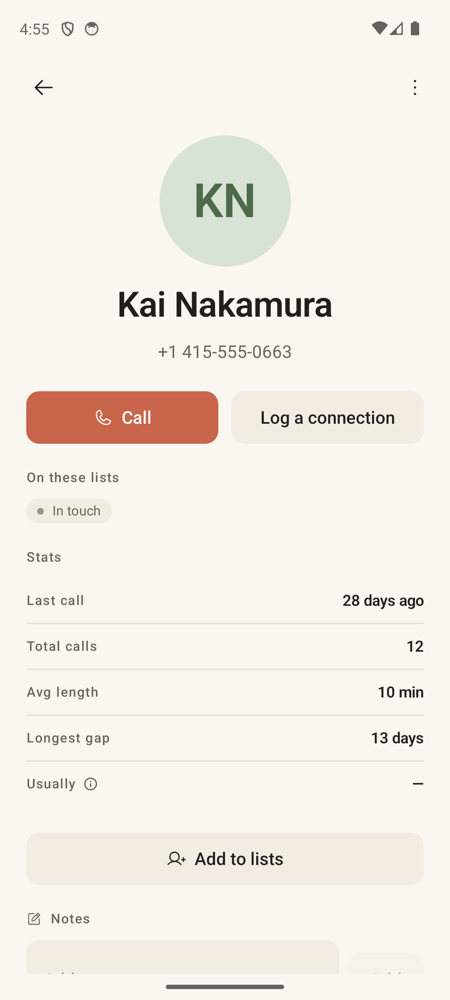
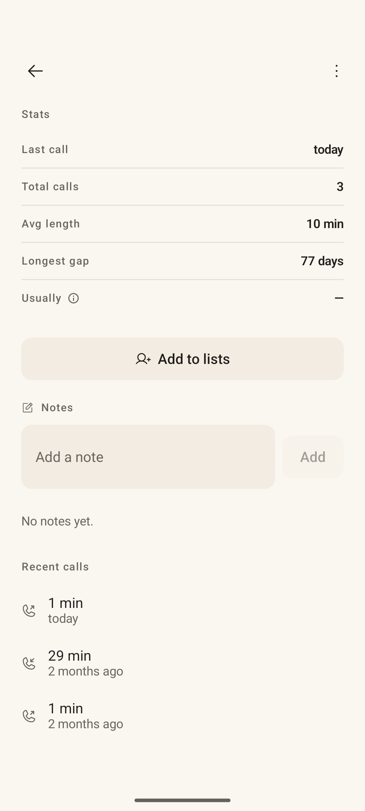

# Contact Detail

> **Intent** — The full picture of one person, and the place you both *act* (call, log a connection, add to lists) and *remember* (notes, history, patterns). Where Card View is a glance, Contact Detail is the deep view you reach for when you want the whole relationship in one place — the memory store that, over time, makes every future card smarter.

**Mission tie** — This is where the "context" that powers the card is created and curated. A good note here is what makes a future Card View able to say "enough to say yes."

---

## Today

- Header: large avatar, **name**, **phone number**, and two actions — **Call** (primary) and **Log a connection** (secondary).
- **On these lists** — the list-membership chips.
- **Stats** — *Last call · Total calls · Avg length · Longest gap · Usually* (the last with an info tooltip; shows "—" when there's no clear window).
- **Add to lists** button.
- **Notes** — an "Add a note" field with an empty state ("No notes yet.").
- **Recent calls** — a clean history with direction icons, durations, and relative times.

Solid and complete. The opportunities are about *closing loops* (when next?) and *lowering the friction of remembering*.

---

## Where it's going

### `CONTACT-1` · Show "comes up again in ~X" · **Now**
The screen tells you everything about the past (last call, longest gap) but nothing about the future. Add a quiet **next-due** line — *"Comes up again in about 2 weeks"* or *"Paused until May 2"*. It answers the silent "have I handled this person?" question and makes the rhythm legible from the one place you'd look to check.

### `CONTACT-2` · Note quick-chips · **Next**
The note field is a blank box, which is the highest-friction way to capture. Offer a row of one-tap chips above it — *"Texted instead" · "Left voicemail" · "Good chat"* — that drop a structured note in one tap. Lower friction here directly improves the data that feeds the card (`CARD-1`). All sentence case, no emoji.

### `CONTACT-3` · Make "Usually —" legible · **Next**
When there's no clear calling window, the **Usually** stat shows a bare em-dash, which reads as broken rather than "not enough data." Either hide the row until there's signal, or label the empty case plainly ("Not enough calls yet"). Honesty over a mysterious dash.

### `CONTACT-4` · Note a call directly from its history row · **Next**
The plumbing already exists (the call log can deep-link here and scroll to a specific call). Surface it: tapping a **Recent calls** row should let you attach a note to *that* call ("the 29-min one in April"). Memory is most useful when it's pinned to the actual moment.

### `CONTACT-5` · Light relationship context · **Later**
Optional, structured fields that make the card richer over time: how you know them, where they are, a date or two that matters. This is the long-term feeder for conversation prompts (`CARD-8`) and occasion-aware surfacing. Keep it optional and unobtrusive — a memory aid, never a CRM.
