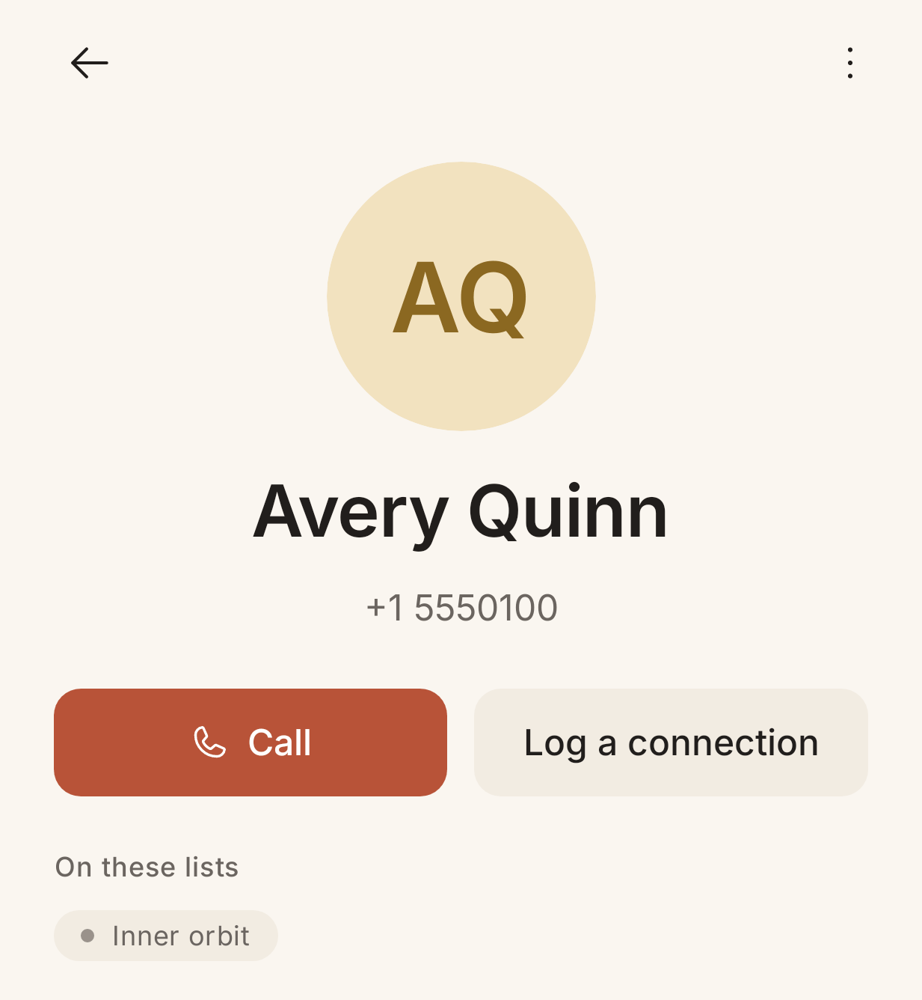
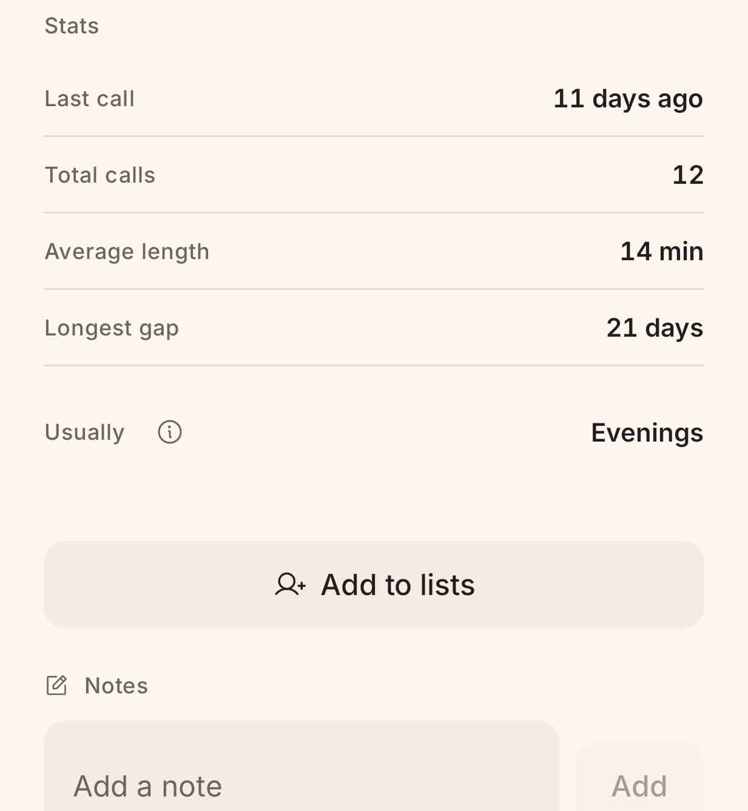

# Contact Detail

> **Intent**: The full picture of one person, and the place you both *act* (call, log a connection, add to lists) and *remember* (notes, history, patterns). Where Card View is a glance, Contact Detail is the deep view you reach for when you want the whole relationship in one place: the memory store that, over time, makes every future card smarter.

**Mission tie**: This is where the "context" that powers the card is created and curated. A good note here is what makes a future Card View able to say "enough to say yes."

---

## Today (as of 2026-10-06)

*JVM gallery render (`PreviewGalleryTest`, Robolectric, light, 411dp, font scale 1.0) at `783a964`, 2026-10-05, not a device capture (`ContactDetailScreen.ContactDetailContentPreview`, cropped in two). The 2026-10-06 contact-detail package changed the overflow menu and the status line after this render; the bullets describe the merged build, and the [Contact detail page view](../../features/page-views/contact-detail.md) is canonical.*

- Header: the face, **name** and **number** ("Number hidden" under the privacy curtain), **Call** (the screen's one accent) and **Log a connection**. The sheet has two modes: **We connected** (a call or a visit Orbit could not see) and **Couldn't reach them** (an attempt: voicemail, no answer); an attempt shows as "Attempted" in history and stays out of the stats.
- A status line under the number where one applies: "Paused until 12 Oct" or "Paused until you unpause" while a pause is in force, "Ignored" or "Archived" for someone who is.
- **More actions for Avery** (the three dots): *View all calls*, *Pause* (or *Unpause* while paused; not offered while the person is ignored), *Open in Contacts* (when the person is in your phone's contacts), then *Ignore* (or *Unignore* while ignored). Pause opens the shared sheet: 1 week, 1 month, Until you unpause; the snackbar names the length and offers Undo.
- **On these lists**: the membership chips ("Not on any list yet" when none). Under the curtain each reads "List".
- **Stats**: *Last call · Total calls · Average length · Longest gap · Usually* (with an info tip). A stat without enough history says **Not enough calls yet** in words, never a dash (CONTACT-3).
- **Add to lists** opens the list picker.
- **Notes**: an "Add a note" field; each note has a "More" menu (Edit, Delete with Undo) as well as the long-press and swipe; the timestamp switches between "11 days ago" and the date. Note bodies read "Note hidden" under the curtain.
- **Recent calls**: direction icons, durations and relative times; "Logged" and "Attempted" rows for connections you recorded by hand.
- For someone on two or more lists, a **Custom schedule** section: "Follows the keep in touch rhythm from Inner orbit." with "Set a schedule for this person".
- States: a hero-shaped placeholder while loading; "This person isn't in Orbit anymore" with Go back; "Couldn't load this person" with Try again (CONTACT-08). A deleted phone contact shows the orphan banner with Re-link and Archive.

Solid and complete. The opportunities are still about *closing loops* (when next?) and *lowering the friction of remembering*.

---

## Where it's going

### `CONTACT-1` · Show "comes up again in ~X" · **Now**
The screen tells you everything about the past (last call, longest gap) and, since 2026-10-05, when a pause ends ("Paused until 12 Oct"), but nothing about the normal future. Add a quiet **next-up** line, *"Comes up again in about 2 weeks"*, next to the pause line's slot. It answers the silent "have I handled this person?" question and makes the rhythm legible from the one place you would look to check. The wording follows Card view's snackbars ("comes up", never "due").

### `CONTACT-2` · Note quick-chips · **Next**
The note field is a blank box, the highest-friction way to capture. Offer a row of one-tap chips above it, *"Texted instead" · "Left voicemail" · "Good chat"*, that drop a structured note in one tap. Lower friction here directly improves the data that feeds the card (`CARD-1`). All sentence case, no emoji.

### `CONTACT-3` · Make "Usually" legible when there is no signal · **Shipped 2026-10-05 (`557c68a`)**
When there was no clear calling window, the **Usually** stat showed a bare dash, which read as broken rather than "not enough data". It now says **Not enough calls yet**, and so do Average length and Longest gap below their floors (three connected calls, or two). Honesty over a mysterious glyph; voice.md forbids the dash as copy.

### `CONTACT-4` · Note a call directly from its history row · **Next**
The plumbing exists (Call history deep-links here and scrolls to a specific call, LOG-03). Surface it on this screen too: tapping a **Recent calls** row should let you attach a note to *that* call ("the 29-minute one in April"). Memory is most useful when it is pinned to the actual moment.

### `CONTACT-5` · Light relationship context · **Later**
Optional, structured fields that make the card richer over time: how you know them, where they are, a date or two that matters. The long-term feeder for conversation prompts (`CARD-8`) and occasion-aware surfacing. Keep it optional and unobtrusive: a memory aid, never a CRM.
