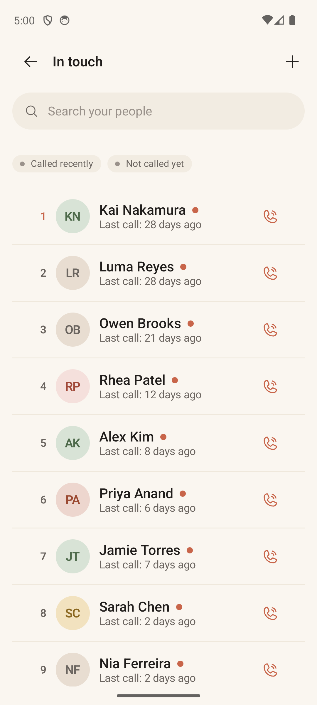

# Browse List

> **Intent** — The whole-list view. Where Card View shows one person, Browse exists to let you see an entire list *as a queue* — who's up, who's next, who's been quiet — and to find or bulk-manage people without leaving the list's frame. It's the "step back and see the orbit" surface, and the place where housekeeping (move, pause, ignore, reorder) happens.

**Mission tie** — Supports the loop rather than running it. Its job is to keep the list *trustworthy* — so that when Card View hands you the top of the queue, you believe it picked the right person.

---

## Today

- **Search** ("Search your people") with debounce.
- Two filter chips: **Called recently** / **Not called yet** (union logic).
- A **numbered queue**: position number, colour avatar, name with a terracotta **due-dot**, last-call meta, and a trailing **call** icon.
- **Long-press** a row for quick actions (Call / Ignore / Pause / Select); **multi-select** mode with a bulk action bar (Move / Copy / Remove), backed by undo snackbars.
- Honest empty states for empty list / filtered-empty / no-match / call-log-denied.

The mechanics are rich; the gap is mostly *legibility and discoverability* — a lot of power is hidden behind long-press.

---

## Where it's going

### `BROWSE-1` · Make the numbered queue mean something · **Next**
The list is numbered 1..N, but nothing tells you what the number *is* — is #1 "most overdue," "next up," "highest priority"? Add a one-line header or legend that names the ordering ("In the order Orbit will surface them →"). A queue you can't read is just a list with numbers on it.

### `BROWSE-2` · Surface multi-select · **Next**
Bulk move/copy/pause/ignore is genuinely useful but is gated entirely behind a long-press that nothing advertises. Add a visible **Select** affordance (an app-bar action, or a "Select" item that's discoverable) so the power isn't invisible. Long-press stays as the fast path for people who know it.

### `BROWSE-3` · Tidy the multi-select row affordances · **Now**
In multi-select the trailing **call** icon still renders but is inert (per the source). Hide or clearly disable it in that mode so there's no dead affordance, and consider a one-time hint the first time someone enters multi-select. Small, but it's the difference between "considered" and "rough."

### `BROWSE-4` · Graceful handling of messy source names · **Later**
Real address books are messy — this list shows *"Eric Henderkson? Sila"*, *"Ben Saa 8:30am Meeting"*, *"Gabriel L (Use This number)"*. Browse is where that ugliness is most visible. This is part of a cross-cutting move (`X-3`): let a person carry a clean **display name / nickname** in Orbit without editing the phone contact, and show the raw name secondary. It makes the whole app feel less like a dump of your contacts and more like *your people*.
