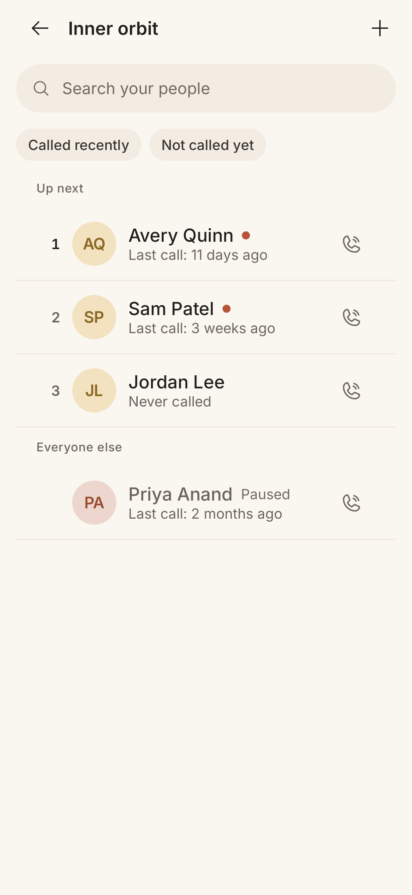

# Browse List

> **Intent**: The whole-list view. Where Card View shows one person, Browse exists to let you see an entire list *as a queue* (who is up, who is next, who has been quiet) and to find or bulk-manage people without leaving the list's frame. It is the "step back and see the orbit" surface, and the place where housekeeping (move, copy, pause, ignore) happens. Rows are not reordered by hand: the order is Orbit's (`features/browse/README.md`, "Custom sort").

**Mission tie**: Supports the loop rather than running it. Its job is to keep the list *trustworthy*, so that when Card View hands you the top of the queue, you believe it picked the right person.

---

## Today (as of 2026-10-05)

*JVM gallery render (`PreviewGalleryTest`, Robolectric, light, 411dp, font scale 1.0) at `783a964`, 2026-10-05, not a device capture (`BrowseListScreen.BrowseContentPreview`).*

- App bar: the list's name, a **+** ("Add people"), and, from this round, a **Select** button so multi-select is not gesture-only (BROWSE-2).
- **Search** ("Search your people"), by name or number, debounced.
- Two filter chips, **Recently called** ("Called recently" in the render; one spelling from this round) and **Not called yet**, as a union; Orbit's own chip with a check when on.
- Sections: **Next up** ("Up next" in the render; one spelling from this round), the numbered queue in the order Orbit will suggest people (BROWSE-1); then **Everyone else** (paused, out of hours, no rhythm), or **On this list** when nobody is queued. Both are headings for TalkBack.
- A row: position number, face, name, an accent dot for someone worth a call now ("Worth a call now" to TalkBack; the screen's one accent), "Paused" or "Ignored" beside the name where it applies, the last-call line, and a **muted** dial button (rules.md Design 6: a quiet dial per row, never the accent).
- **Long-press** a row for **Quick actions**: Call, Select, Pause (Unpause when paused), Ignore. Pause opens the shared sheet (1 week, 1 month, Until you unpause).
- **Multi-select**: the bar replaces the app bar (exit, "N selected", More actions), then Move to…, Copy to…, Remove; the overflow adds Pause all and Ignore all. Every bulk action has Undo. The dial is hidden on selected rows rather than left inert.
- Honest states (BROWSE-06): a quiet skeleton while the list loads; "No one here yet" with Add people; filtered-empty and no-match states with a way out; a notice when Orbit cannot see your calls; "Couldn't load this list" with Try again.

The mechanics were always rich; the legibility gaps (what the number means, where multi-select lives, a dead dial) are closed.

---

## Where it's going

### `BROWSE-1` · Make the numbered queue mean something · **Shipped 2026-10-05 (`f2918f8`)**
The list was numbered 1 to N, but nothing said what the number *was*. The queue now sits under a **Next up** heading, so the numbers read as "the order Orbit will surface them", and everyone outside the rotation sits under "Everyone else". A queue you can read, not a list with numbers on it.

### `BROWSE-2` · Surface multi-select · **Shipped 2026-10-05 (the browse package of this round)**
Bulk move, copy, pause and ignore were gated entirely behind a long-press nothing advertised. A visible **Select** button in the app bar ("Select people") now enters multi-select; its bar actions stay disabled until something is selected, so nothing becomes a silent no-op (rules.md Code 3), and Back or the X leaves. Long-press stays as the fast path for people who know it.

### `BROWSE-3` · Tidy the multi-select row affordances · **Shipped 2026-10-05 (`d8d7db0`)**
In multi-select the trailing dial rendered but was inert. It is now hidden in that mode (`BrowseRow`'s `showDial`), so there is no dead affordance. The one-time hint proposed here was not added.

### `BROWSE-4` · Graceful handling of messy source names · **Later**
Real address books are messy: *"Eric Henderkson? Sila"*, *"Ben Saa 8:30am Meeting"*, *"Gabriel L (Use This number)"*. Browse is where that ugliness is most visible. Part of a cross-cutting move (`X-3`): let a person carry a clean **display name** in Orbit without editing the phone contact, and show the raw name secondary. It makes the whole app feel less like a dump of your contacts and more like *your people*.
