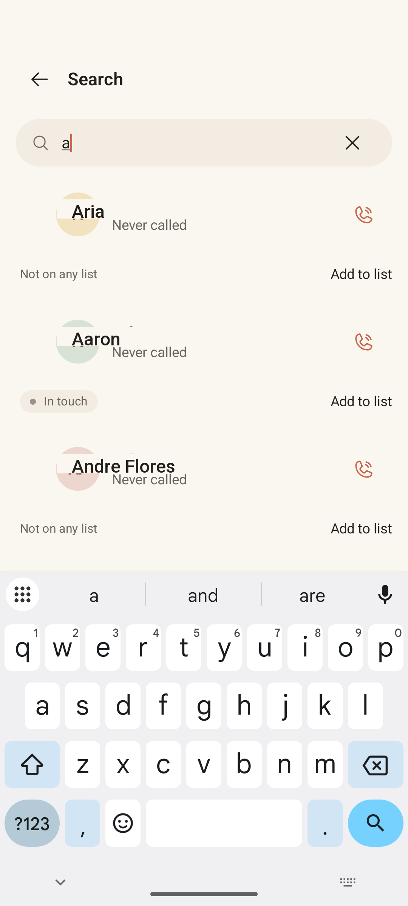

# Search

> **Intent** — The direct line. Search exists for the moment you already know who you want — you don't need the loop to pick for you, you just need to get to *that one person* and act, from anywhere in the app. Speed and a clean path to "call / add to list" are the entire job.

**Mission tie** — The escape hatch from the loop. The loop answers "who should I call?"; search answers "I already know — let me at them." Both must feel effortless.

---

## Today

- A focused **Search people** field with the keyboard up and an empty prompt ("Search people by name.").
- Results are clean rows: avatar, name, call status ("Never called"), a list-membership chip or **"Not on any list,"** a trailing **call** icon, and an **Add to list** action.

Functional and tidy. The two gaps: the empty state is wasted, and search is name-only while the picker searches numbers too.

---

## Where it's going

### `SEARCH-1` · A useful empty state · **Next**
Before you type, the screen is blank. That's prime space for the most valuable shortcut in the app: **people not on any list** — the contacts you actually interact with but haven't filed yet. Surfacing them here ("People you've called who aren't on a list") turns a dead screen into the fastest on-ramp to organizing your orbits, and it directly feeds the core loop (more filed people = more the card can surface).

### `SEARCH-2` · Search by number too · **Next**
The contact picker already matches on name *or* number; search matches name only. Unify them so "search" means the same thing everywhere. Someone who half-remembers a number shouldn't hit a wall here.

### `SEARCH-3` · A touch more context per result · **Later**
Results show call status but could quietly carry the one fact that makes the row actionable — last contacted, or which lists they're on — so you can act straight from search without a detour into Contact Detail. Keep it to a single line; search results should stay scannable.
