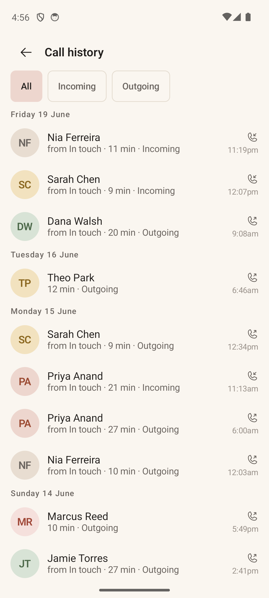

# Call Log

> **Intent** — An honest, calm record of the real calls between you and your people. The Call Log exists so the history Orbit reasons about is *visible and trustworthy* — you can see what actually happened (and what you manually logged), grouped by day, without it ever feeling like a surveillance ledger. It backs the app's claims ("last called 2 months ago") with something you can look at.

**Mission tie** — Trust infrastructure. The card's "why now" is only believable if the underlying history is legible. This is where that legibility lives.

---

## Today

- App bar **Call history**; three direction filter chips (**All / Incoming / Outgoing**).
- A `LazyColumn` with **sticky day headers** ("Today" / "Yesterday" / "Wednesday 3 June").
- Rows: avatar, name, a composited subtitle (list context · duration · direction), and a trailing **direction icon + wall-clock time** ("4:30pm").
- **Manual "Logged" events** (connections you recorded by hand) appear with a check-circle icon and no duration.
- **Ignored** contacts render at half-opacity with an "(ignored)" suffix but stay tappable.
- Honest **"Show N more"** pagination (shows the real next increment, not a vague "load more").
- Long-press a row for *Call again / Open contact*.

A careful, honest screen already. The moves are about capture and findability.

---

## Where it's going

### `LOG-1` · Inline "add a note" on a call · **Next**
The log is where you're reminded a call happened — so it's the natural place to capture what it was about. Add an inline **Add a note** on a row (especially a just-ended call), mirroring the Home post-call banner. Same instinct as `CARD-1`/`CONTACT-2`: capture context at the moment it's freshest, where the user already is.

### `LOG-2` · Filter by person or list, not just direction · **Later**
Today you can filter by direction only. Letting someone scope the log to one person or one list ("just my Family calls") turns it from a flat feed into a tool for reflecting on a specific relationship or orbit.

### `LOG-3` · Render a placeholder for blank durations · **Next**
Manual "Logged" events have no duration, leaving the subtitle sparse and slightly broken-looking. Render a consistent "—" (or omit the segment cleanly) so logged and real calls share one honest visual rhythm.
