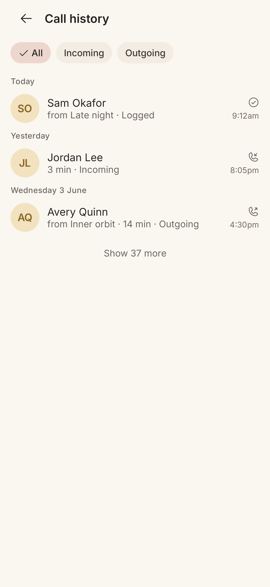

# Call Log

> **Intent**: An honest, calm record of the real calls between you and your people. The Call Log exists so the history Orbit reasons about is *visible and trustworthy*: you can see what actually happened (and what you logged by hand), grouped by day, without it ever feeling like a surveillance ledger. It backs the app's claims ("It's been 2 months.") with something you can look at.

**Mission tie**: Trust infrastructure. The card's "why now" is only believable if the underlying history is legible. This is where that legibility lives.

---

## Today (as of 2026-10-05)

*JVM gallery render (`PreviewGalleryTest`, Robolectric, light, 411dp, font scale 1.0) at `783a964`, 2026-10-05, not a device capture (`CallLogScreen.CallLogContentPreview`).*

- App bar **Call history**; three direction chips (**All / Incoming / Outgoing**), one always chosen.
- **Sticky day headings** ("Today", "Yesterday", "Wednesday 3 June"), headings for TalkBack.
- Rows: face, name, a subtitle of list context, duration and direction ("from Inner orbit · 14 min · Outgoing"), and a trailing direction icon with the wall-clock time ("4:30pm"), in the phone's 12 or 24 hour setting.
- **Logged** rows (a connection you recorded by hand) show a check-circle and no duration; **Attempted** rows (a reach-out that did not connect: logged by hand as "Couldn't reach them", or an unanswered outgoing call) show a phone-slash and no duration. Both count as reaching out, so they appear under All and Outgoing.
- **One person's log** (LOG-04): from Contact detail, "View all calls" opens "Calls with Avery", where rows lead with what happened ("You called", "Avery called", "You logged a connection", "You tried to reach them") and back returns to the person.
- **Ignored** people render at half opacity with an "(ignored)" suffix but stay tappable.
- Honest **"Show N more"** pagination: the real next increment, never a vague "load more".
- Tap a row to open the person with "Add note to this call" under that call (LOG-03). Long-press (and, from this round, a three-dots button, "More actions for Avery") for *Call again / Open details*.
- Honest states (LOG-05): a skeleton while loading; "No calls yet" only when Orbit can read the call log and there are none; "Orbit can't see your calls" with Open settings when access is off and nothing is recorded; a notice above the rows when access is off but history exists; "Couldn't load your calls" with Try again.

A careful, honest screen. Its vision items below keep their `LOG-1` to `LOG-3` handles and point at the requirement IDs (`LOG-03`, `LOG-04`, `LOG-05` in `features/call-history/README.md`) that answered them.

---

## Where it's going

### `LOG-1` · Inline "add a note" on a call · **Resolved 2026-10-05 by LOG-03**
The log is where you are reminded a call happened, so it is the natural place to capture what it was about. The chosen path: a tap on a row lands on the person with the focused call and "Add note to this call" beneath it, one tap, no detour. A separate inline note affordance on the row was left out on purpose: tap already does it, and a second control would say one action two ways.

### `LOG-2` · Filter by person or list, not just direction · **Part shipped 2026-10-05 (LOG-04); the list filter stays Later**
Filtering to one person shipped as "View all calls" from Contact detail: "Calls with Avery", a log scoped to one relationship. Scoping to one list ("just my Family calls") is still open; it is useful but adds a control to a calm screen, so it waits for someone to ask (`features/call-history/README.md`, open questions).

### `LOG-3` · Render a placeholder for blank durations · **Resolved 2026-10-05: the segment is omitted**
Logged and Attempted rows have no duration. The decision was to drop the segment cleanly rather than print a dash: voice.md forbids glyphs as copy, and a dash in a stat slot had already leaked onto Card view's statistics once (`RelativeTime.kt`). The subtitle reads "from Late night · Logged" and nothing looks missing.
