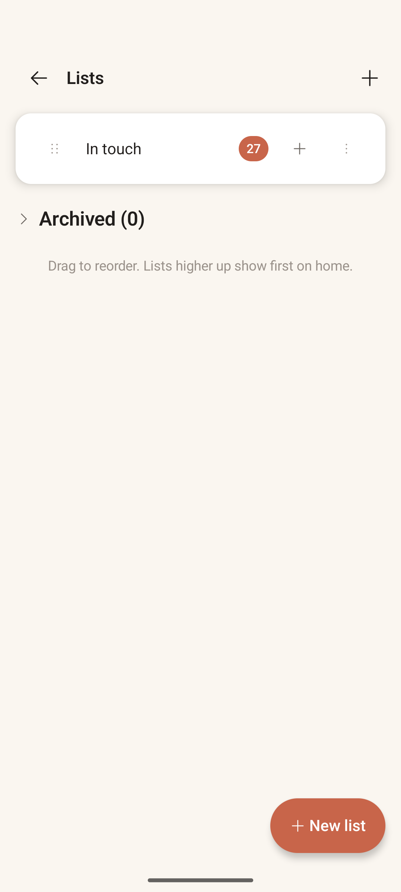
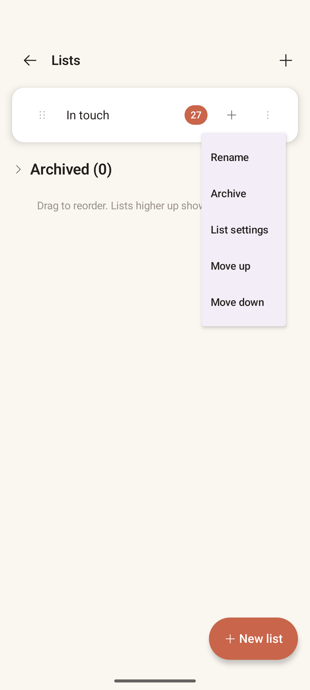

# Lists Manager

> **Intent** — Where you shape your orbits. This screen exists to let you see all your lists at once and control them as a set — their order (which is also their priority on Home), their names, and their lifecycle (archive). It's the "zoom out to the constellation" view: not about any one person, but about how you've chosen to organize the people who matter.

**Mission tie** — Lists *are* Orbit's answer to "who should I call?" — they're the buckets the loop draws from. Keeping them easy to shape keeps the loop's output trustworthy.

---

## Today

- One row per list: **drag handle**, name, **member count** badge, a **+** (add contacts), and an **overflow ⋯**.
- An **Archived (N)** collapsible section.
- Helper text: *"Drag to reorder. Lists higher up show first on home."*
- Two ways to create: a **+** in the app bar **and** a **New list** FAB.
- Overflow menu: *Rename · Archive · List settings · Move up · Move down*.

Clean and functional, with two rough edges: a redundant create affordance and an off-brand menu surface.

---

## Where it's going

### `LISTS-1` · Remove the redundant "create list" · **Now**
There are two controls that do the same thing — the app-bar **+** and the **New list** FAB. Keep the FAB (it's the clearer primary), drop the app-bar plus. One obvious way to create a list, not two.

### `LISTS-2` · Warm-theme the overflow menu · **Now**
The dropdown renders on Material's default **lavender** surface — the one place the warm palette visibly breaks (the same drift appears on Card View's list-actions menu). Point `DropdownMenu` at `surface` / `accentTint` so menus match the cream-and-terracotta system. Part of cross-cutting `X-1`.

### `LISTS-3` · Show each list's rhythm in its row · **Next**
A list's whole personality is its cadence, but the row only shows a name and a count. Add a quiet second line — *"every 2 days · weekdays"* — so you can read how each orbit behaves at a glance, without opening its config. It makes the constellation legible.

### `LISTS-4` · A light health hint · **Later**
Optionally surface a calm signal when a list has drifted — e.g., a soft "5 overdue" — so a neglected orbit can gently raise its hand. The bar: it must read as information, never as guilt or a badge. If it can't be calm, leave it out.
