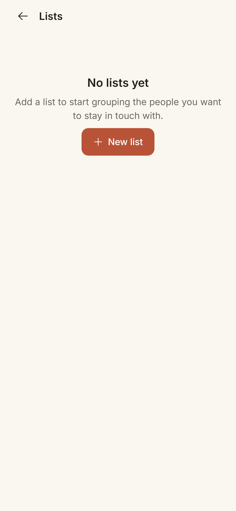
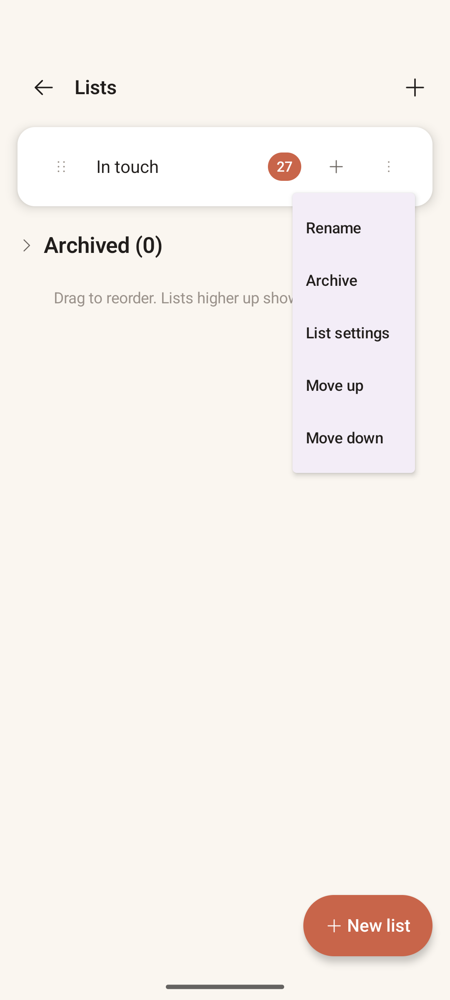

# Lists Manager

> **Intent**: Where you shape your orbits. This screen exists to let you see all your lists at once and control them as a set: their order (which is also their order on Home), their names, and their lifecycle (archive, delete). It is the "zoom out to the constellation" view: not about any one person, but about how you have chosen to organise the people who matter.

**Mission tie**: Lists *are* Orbit's answer to "who should I call?": the buckets the loop draws from. Keeping them easy to shape keeps the loop's output trustworthy.

---

## Today (as of 2026-10-06)

*First image: JVM gallery render (`PreviewGalleryTest`, Robolectric, light, 411dp, font scale 1.0) at `783a964`, 2026-10-05, not a device capture (`ListsManagerScreen.ListsManagerContentPreview`, which is the empty state; no populated Lists preview exists). Second: the June 2026 capture. The 2026-10-06 lists package added Pause nudges / Resume nudges to the row menu after this render; the bullets describe the merged build, and the [Lists page view](../../features/page-views/lists-manager.md) is canonical.*

- **With lists**: one row per list: a drag handle ("Reorder list"), the name, a **Smart list** chip where the list fills itself, a quiet second line (the rule for a smart list, "Recently added · 30 days"; from this round the rhythm for a regular list, "Every 14 days", LISTS-3), the member count, a **+** ("Add people to Inner orbit") and a three-dots button ("More actions for Inner orbit").
- The row menu, on Orbit's own menu surface: *Rename · List settings · Pause nudges* (or *Resume nudges* while they are paused) *· Move up · Move down*, then **Archive** below a divider, in the danger tone, with the line "Hides Inner orbit from home. You can restore it." under it, per the shared menu contract (`design/README.md`, "Menus"). Pause nudges and the Archive line are Home's strings, so the two menus cannot drift word by word.
- **Tap a row to open its deck**, as on Home (LIST-23). List settings is one step away in the row menu. (At `783a964` a regression sent "List settings" and a newly created list to the deck as well; fixed in this round's lists package.)
- **One way to create** (LIST-20): a floating **New list** button when lists exist; the centred button above when there are none. The app bar's "+" is gone.
- An **Archived (N)** section that expands to rows with Restore, Delete ("Delete this list?", then "List deleted." with Undo, held until the snackbar goes) and List settings.
- Helper text: *"Drag to reorder. Lists higher up show first on home."*
- "Orbit couldn't load your lists" with Try again if reading fails (LIST-22).

The two rough edges this file named in June, the redundant create control and the off-brand menu, are gone.

---

## Where it's going

### `LISTS-1` · Remove the redundant "create list" · **Shipped 2026-10-05 (`a961e2b`, LIST-20)**
Two controls did the same thing, the app-bar **+** and the **New list** button. The button stayed (floating with lists, centred without) and the plus went. One obvious way to create a list, not two; and the empty state no longer carries two accent elements.

### `LISTS-2` · Warm-theme the overflow menu · **Shipped 2026-10-05 (`1af5d3e`, with `X-1`)**
The dropdown rendered on Material's default **lavender** surface, the one place the warm palette visibly broke. Every Material slot is now mapped to Orbit's tokens (DESIGN.md "Material parts look like Orbit"), so menus, sheets and dialogs match the cream-and-terracotta system everywhere.

### `LISTS-3` · Show each list's rhythm in its row · **Shipped 2026-10-05 (the lists package of this round)**
A list's whole personality is its rhythm, but a regular list's row showed only a name and a count. Each row now carries a quiet second line: the rule for a smart list ("Recently added · 30 days"), the rhythm for a regular one ("Every 14 days", "Late night rhythm"). The constellation is legible without opening List settings.

### `LISTS-4` · A light health hint · **Later**
Optionally surface a calm signal when a list has drifted, so a neglected orbit can gently raise its hand. The bar: it must read as information, never as guilt or a badge, and never as a count of people "due" (voice.md). If it cannot be calm, leave it out.
