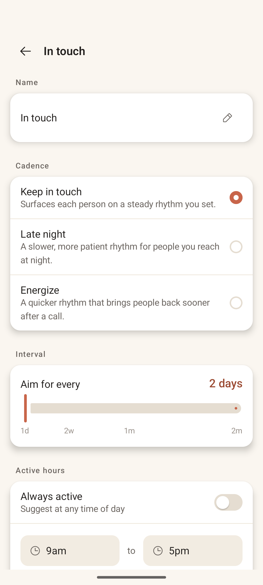
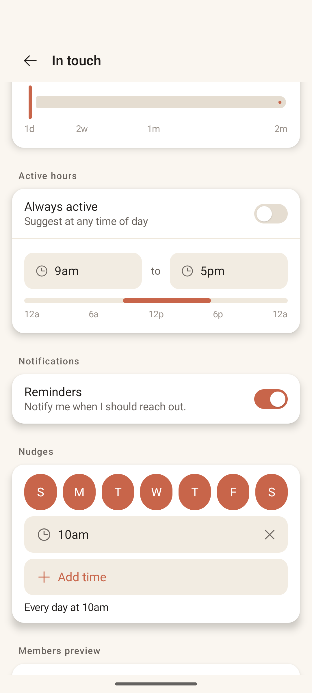
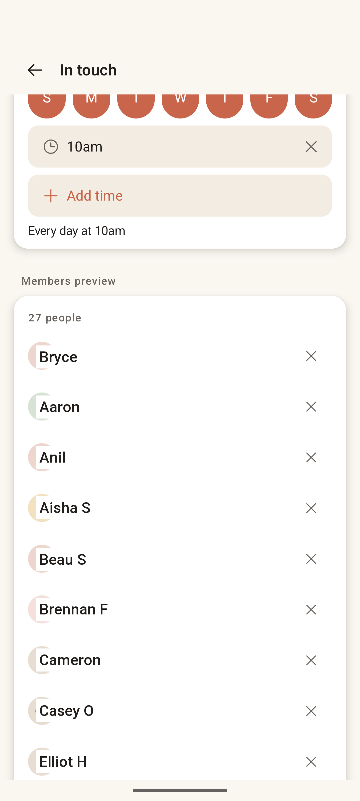

# List Configuration

> **Intent** — Where a list's *rhythm* is defined. This screen exists to translate a human intention ("check in with family every couple of weeks, but not late at night") into the cadence, hours, nudges, and membership the engine uses to decide who surfaces when. Its job is to make a fairly deep set of controls feel like setting a vibe, not programming a scheduler.

**Mission tie** — This is the dial that controls *what the loop surfaces*. Get it legible and it becomes the user's main lever over "who should I call?"; get it intimidating and people leave it on defaults forever.

---

## Today

- **Name** field.
- **Cadence** templates (Keep in touch / Late night / Energize), each with a plain-language description.
- An **Interval** slider ("Aim for every — 2 days") on a non-linear 1d→2m scale.
- **Active hours**: an "Always active" toggle plus from/to time pickers and a visual day-bar.
- **Notifications** toggle ("Notify me when I should reach out").
- **Nudges**: seven day-of-week circles + one or more times + "Add time."
- A **Members preview** with add/remove.

It's powerful and well-built — but it's *dense*, and it asks the user to assemble the rhythm in their head from six separate controls.

---

## Where it's going

### `CONFIG-1` · One plain-language rhythm summary · **Now**
Add a single sentence at the top (or pinned) that translates every control into one readable line: *"You'll see each person about every 2 days, on weekdays 9am–5pm, with a nudge at 10am."* It turns six controls into one comprehensible outcome and lets someone confirm "yes, that's the vibe I wanted" without parsing each widget. Highest-value change on this screen.

### `CONFIG-2` · Tuck the advanced controls away · **Next**
For a first-time list, the full stack (nudge days, multiple nudge times, exact active hours) is intimidating. Lead with the essentials — name, cadence, interval — and collapse **Active hours** and **Nudges** under an "Advanced" reveal. The depth stays for power users; the first run feels like picking a vibe, not filling a form.

### `CONFIG-3` · Lighten the seven-circle nudge block · **Next**
Seven filled terracotta day-circles is a heavy, busy block that dominates the section. Replace the common case with a simple **"Every day / Weekdays / Custom"** control and only expose the per-day circles under Custom. Same capability, far calmer default.

### `CONFIG-4` · Live "who this surfaces" preview · **Later**
The ultimate legibility move: as the user tunes the rule, show a small live preview of *which people* it would surface and roughly how often. It closes the gap between abstract settings and concrete outcome — you'd *see* your rhythm, not just describe it.
