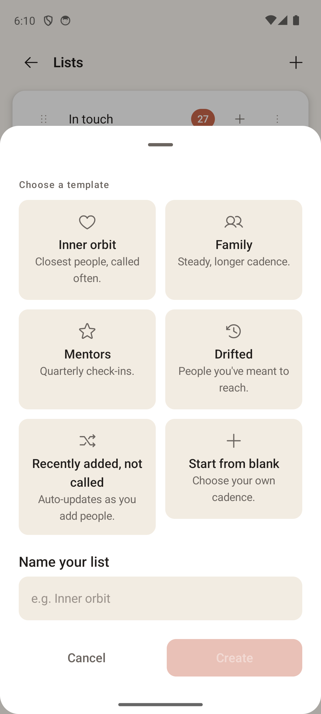

# Create List

> **Intent** — The on-ramp to a new orbit. This sheet exists to help you start a list from an *intention* — "these are my closest people," "people I've drifted from" — rather than a blank form. By leading with named templates, it does the hardest part (picking a sensible rhythm) for you, so creating a list feels like naming a relationship category, not configuring a scheduler.

**Mission tie** — Every list is a future answer to "who should I call?" The easier and more intentional it is to create one, the richer the loop's raw material.

---

## Today

- A bottom sheet titled **Choose a template**.
- A 2×3 grid of templates, each with an icon, name, and a one-line description:
  - **Inner orbit** — "Closest people, called often."
  - **Family** — "Steady, longer cadence."
  - **Mentors** — "Quarterly check-ins."
  - **Drifted** — "People you've meant to reach."
  - **Recently added, not called** — "Auto-updates as you add people."
  - **Start from blank** — "Choose your own cadence."
- A **Name your list** field (auto-fills from the template), and **Cancel / Create** (Create stays disabled until there's a name and a template).

A genuinely lovely, on-brand entry point — the template names *are* the product's worldview. The opportunities are about making the consequence of a choice visible.

---

## Where it's going

### `CREATE-1` · Show each template's resulting rhythm · **Next**
A template silently sets a cadence, but you can't see what you're choosing until after the list exists. Surface the resulting rhythm inline — e.g., under "Family," *"about every 3 weeks."* So the choice is informed, and the link between the friendly name and the actual behavior is clear from the start. Pairs naturally with `CONFIG-1`.

### `CREATE-2` · "From a moment" templates · **Later**
The current templates describe *kinds of people*. There's room for templates that describe *a moment*: "Reconnect" (people you've drifted from, gentle pace), "New in town," "Going through something." These meet the user where a real impulse to organize usually starts — an event, not a taxonomy.

### `CREATE-3` · Clarify the name auto-fill behavior · **Next**
Today, switching templates only overwrites the name if the field is still empty (it won't clobber something you typed). That's the right instinct but can surprise — you pick "Family," see "Family," switch to "Mentors," and the name stays "Family." Make the relationship between template and name obvious (e.g., a subtle hint, or a clear "using template name" state) so it never feels like a glitch.
