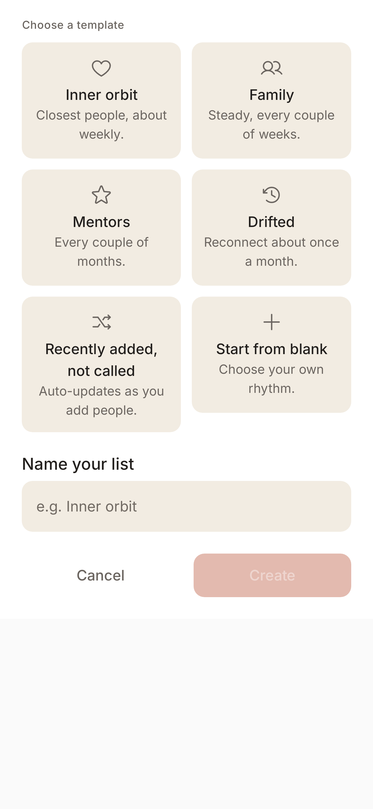

# Create List

> **Intent**: The on-ramp to a new orbit. This sheet exists to help you start a list from an *intention* ("these are my closest people", "people I've drifted from") rather than a blank form. By leading with named templates, it does the hardest part (picking a sensible rhythm) for you, so creating a list feels like naming a relationship category, not configuring a scheduler.

**Mission tie**: Every list is a future answer to "who should I call?" The easier and more intentional it is to create one, the richer the loop's raw material.

---

## Today (as of 2026-10-05)

*JVM gallery render (`PreviewGalleryTest`, Robolectric, light, 411dp, font scale 1.0) at `783a964`, 2026-10-05, not a device capture (`CreateListBottomSheet.CreateListBottomSheetLightPreview`).*

- A bottom sheet titled **Choose a template**.
- A 2×3 grid of templates, each with an icon, a name and a one-line description that names the rhythm it sets (CREATE-1):
  - **Inner orbit**: "Closest people, about weekly." (every 7 days)
  - **Family**: "Steady, every couple of weeks." (14 days)
  - **Mentors**: "Every couple of months." (60 days, the slider's cap)
  - **Drifted**: "Reconnect about once a month." (30 days)
  - **Recently added, not called**: "Auto-updates as you add people." (a smart list)
  - **Start from blank**: "Choose your own rhythm." (the 2-day default)
- A **Name your list** field (filled from the template while empty) and **Cancel / Create** (Create stays disabled until there is a name and a template). Create opens List settings for the new list.

A genuinely lovely, on-brand entry point: the template names *are* the product's worldview, and each now tells you what it will do.

---

## Where it's going

### `CREATE-1` · Show each template's resulting rhythm · **Shipped 2026-10-05 (`df3b41b`, B5)**
A template silently set a rhythm you could not see until the list existed; worse, every template made the same 2-day list. Each template now writes its own interval and its subtitle says so ("Steady, every couple of weeks."), so the choice is informed and the friendly name matches the behaviour from the start. Pinned by `CreateListTemplateCatalogTest`.

### `CREATE-2` · "From a moment" templates · **Later**
The current templates describe *kinds of people*. There is room for templates that describe *a moment*: "Reconnect" (people you have drifted from, gentle pace), "New in town", "Going through something". These meet the user where a real impulse to organise usually starts: an event, not a taxonomy.

### `CREATE-3` · Clarify the name auto-fill behaviour · **Next**
Switching templates only overwrites the name if the field is still empty (it will not clobber something you typed). The right instinct, but it can surprise: pick "Family", see "Family", switch to "Mentors", and the name stays "Family". Make the relationship between template and name obvious (a subtle hint, or a clear "using template name" state) so it never feels like a glitch.
