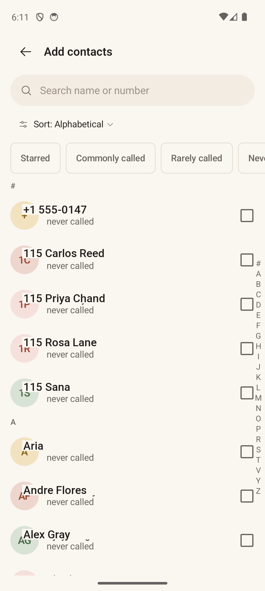
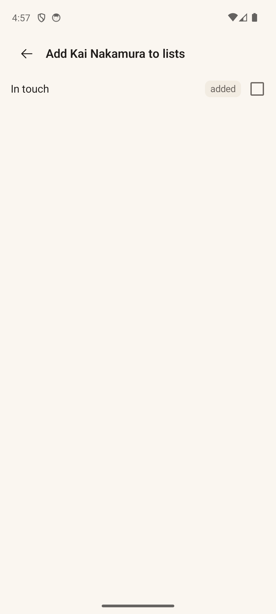

# Pickers (Add Contacts · Add to Lists)

> **Intent** — The two "filing" surfaces. The **Contact Picker** ("Add contacts") exists to get the right people *into* a list fast, from a potentially huge address book. The **List Picker** ("Add to lists") is the reverse — given a person, file them into the right orbits. Both exist to make organizing feel like quick triage, not data entry, because the value of every other screen depends on the right people being in the right lists.

**Mission tie** — Garbage in, garbage out: the loop can only surface people you've filed. These screens are how the loop's raw material gets created, so friction here quietly caps the whole product.

---

## Today

**Contact Picker** (left): search by **name or number**, a **Sort** control (Alphabetical / Most called / Recently called / Recently saved), **filter chips** with live counts, **A–Z sticky headers + fast-scroll rail**, per-row **checkboxes**, an **"added"** badge for existing members, a **Select all N matches** affordance, and a docked **batch counter** ("N selected · Add to X"). Thoughtful detail: when you select a contact at the bottom, the list auto-scrolls so the appearing batch bar doesn't hide it. *(Shown on a full address book — captured before the device was reseeded — to show the A–Z rail and populated list; the live seed has only a handful of contacts.)*

**List Picker** (right): the reverse — a checkbox list of your lists with **"added"** badges, a docked "Add to N lists" footer, and **inline list creation** when you have none yet.

These are dense, capable, and clearly loved. The moves are about *guidance* and *clarity*, not mechanics.

---

## Where it's going

### `PICK-1` · Clarify the "added" badge · **Next**
On both pickers, an "added" badge marks people/lists you're already a member of — but it reads ambiguously ("already in" vs "just added"). Use a clearer state (a check + muted "already in this list") so there's no second-guessing what the badge means.

### `PICK-2` · Smart suggestions at the top · **Next**
The single most valuable thing a picker can do is reduce the search. Lead the Contact Picker with **"People you call but haven't filed"** — contacts with real call history and no list. It turns "scroll your entire address book" into "confirm the obvious ones," and it's the same untapped on-ramp proposed for Search (`SEARCH-1`).

### `PICK-3` · Flag names that look like notes · **Later**
Address-book reality leaks in here too ("Gabriel L (Use This number)"). Where a name clearly contains a note, offer a gentle one-tap **"clean up name"** that proposes a display name (see cross-cutting `X-3`). Filing someone is the perfect moment to also tidy how they'll appear everywhere else.
