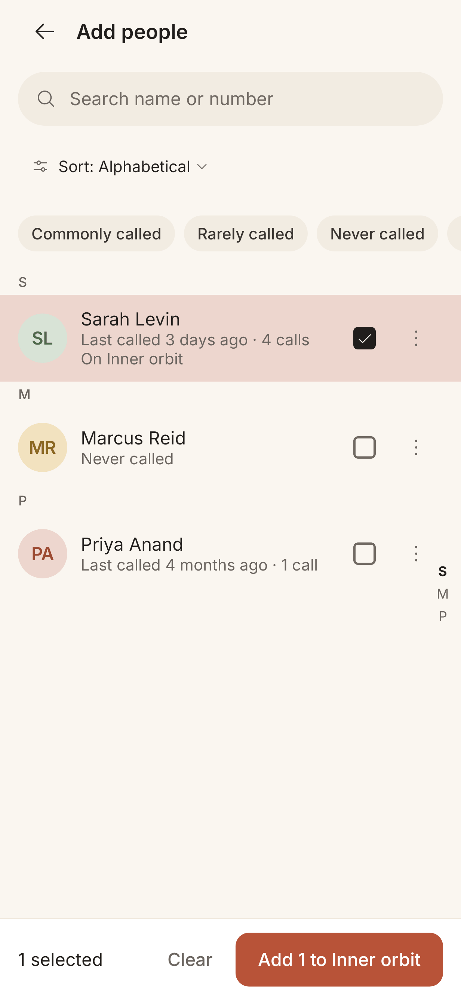
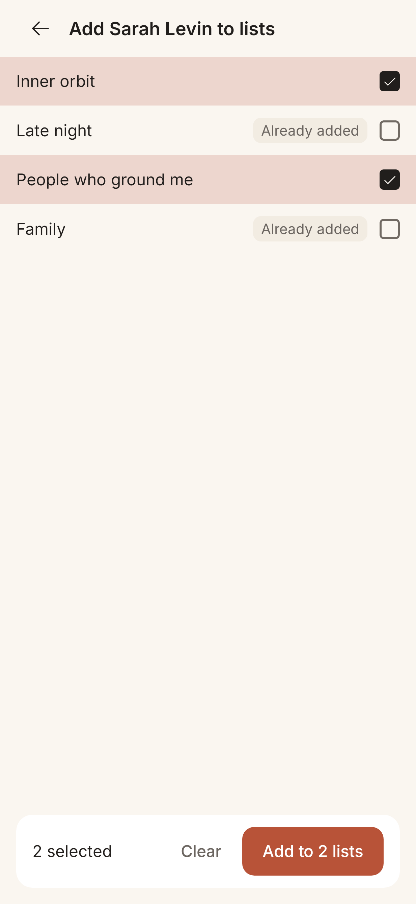

# Pickers (Add people · Add to lists)

> **Intent**: The two "filing" surfaces. The **contact picker** ("Add people") exists to get the right people *into* a list fast, from a potentially huge address book. The **list picker** ("Add to lists") is the reverse: given a person, file them into the right orbits. Both exist to make organising feel like quick triage, not data entry, because the value of every other screen depends on the right people being in the right lists.

**Mission tie**: Garbage in, garbage out: the loop can only surface people you have filed. These screens are how the loop's raw material gets created, so friction here quietly caps the whole product.

---

## Today (as of 2026-10-05)

*JVM gallery render (`PreviewGalleryTest`, Robolectric, light, 411dp, font scale 1.0) at `783a964`, 2026-10-05, not a device capture (`ContactPickerScreen.ContactPickerContentPreview` and `ListPickerScreen`'s ready preview). The June capture of a full address book, which showed the A to Z rail at scale, is replaced; the rail is visible at the right edge here.*

**Contact picker** (left): titled by mode (**Add people**, "Move 3 people", "Copy 1 person", "Re-link contact"); search by **name or number**; a 48dp **Sort** control (Alphabetical / Most called / Recently called / Recently added); **filter chips** (Commonly called, Rarely called, Never called, Long gap, Not on a list, On a list), applied ones in their own row with live counts; **A to Z headings and a fast-scroll rail**; rows with the face, name, "Last called 3 days ago · 4 calls" or "Never called", the lists they are on ("On Inner orbit"), Orbit's own check mark, and a three-dots button ("More actions for Sarah Levin": Open in Contacts, Ignore or Unignore). People already on the list are **hidden** in Add mode rather than badged. "Select all 14 matches" when a search or filter narrows the list; a docked bar ("1 selected · Clear · Add 1 to Inner orbit") that never hides the last row. A permission ask with "Grant access", a denied state with "Open phone settings", and "Couldn't load your contacts" with Try again (PICK-09). The commit button is the only accent.

**List picker** (right): "Add Sarah Levin to lists" (the name drops under the privacy curtain); a row per list with a check mark and **Already added** where she is on it already; a docked "Add to 2 lists"; inline list creation when you have none yet.

Dense, capable and consistent with the rest of the app since 2026-10-05 (`abfae55`: Orbit's chips, checks and menus; 48dp everywhere; plain words). The remaining moves are about *guidance*.

---

## Where it's going

### `PICK-1` · Clarify the "added" badge · **Shipped 2026-10-05 (`abfae55`)**
A lowercase "added" badge read as "just added" as easily as "already in". Decided two ways, one per picker: the contact picker **hides** people already on the list in Add mode (there is nothing to decide about them), and the list picker says **Already added** in words. No second-guessing what a badge means.

### `PICK-2` · Smart suggestions at the top · **Next**
The single most valuable thing a picker can do is reduce the search. Lead the contact picker with **"People you call but haven't filed"**: contacts with real call history and no list. It turns "scroll your entire address book" into "confirm the obvious ones", and it is the same untapped on-ramp proposed for Search (`SEARCH-1`). The "Not on a list" filter is the raw material; this would surface it unasked.

### `PICK-3` · Flag names that look like notes · **Later**
Address-book reality leaks in here too ("Gabriel L (Use This number)"). Where a name clearly contains a note, offer a gentle one-tap **"clean up name"** that proposes a display name (see cross-cutting `X-3`). Filing someone is the perfect moment to also tidy how they will appear everywhere else.
