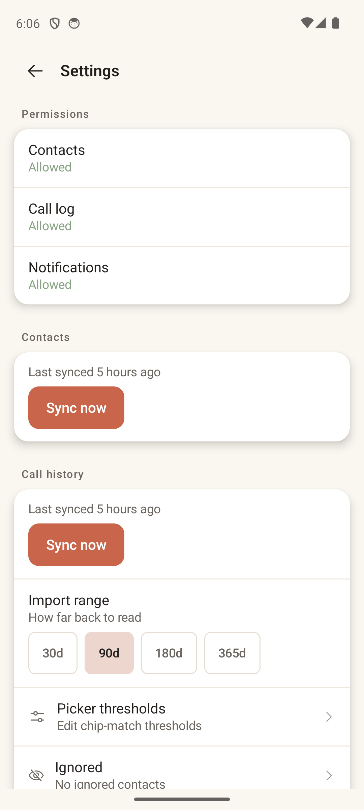

# Settings

> **Intent** — Trust and control. Settings exists to make the app's relationship with your data legible and adjustable — what permissions it has, what it's synced and how far back, how it makes its matching decisions, and who you've chosen to ignore. For a local-only, privacy-first app, this screen is where the central promise ("everything stays on your phone") is either reinforced or quietly assumed.

**Mission tie** — Indirect but foundational. The core loop runs on contacts + call history; people only grant that access if they trust the app. Settings is where that trust is maintained.

---

## Today

- **Permissions** — Contacts / Call log / Notifications, each showing **Allowed** (green) or a tap-to-grant state.
- **Contacts** — "Last synced 5 hours ago" + **Sync now**.
- **Call history** — last-synced + **Sync now**, and an **Import range** selector (30d / 90d / 180d / 365d).
- **Picker thresholds** — "Edit chip-match thresholds" ›
- **Ignored** — "No ignored contacts" ›

Clean, honest, and well-scoped. The notable gap is that the app's biggest selling point — privacy — is implied here but never *stated*.

---

## Where it's going

### `SETTINGS-1` · Say the privacy promise out loud · **Next**
Orbit's defining choice is local-only, no cloud, no telemetry — and Settings is exactly where a privacy-minded user goes looking for reassurance. Add a short, plain **privacy line or section**: *"Everything stays on this phone. Orbit has no account, no servers, and never uploads your contacts or calls."* It's free trust, it differentiates the app, and it's the honest thing to do where people expect to find it. (It also pre-answers the Play Data Safety story.)

### `SETTINGS-2` · A global quiet-hours / notifications summary · **Later**
Nudges are configured per list, which is powerful but means there's no single place to see or dampen them all. A global "quiet hours" and a one-glance summary of "what will notify you, when" gives a calm app a calm master volume knob.

### `SETTINGS-3` · Make "Ignored" feel like a recoverable choice · **Next**
Ignoring is a reversible decision, so its home in Settings should make the count visible and un-ignoring effortless. Surface "N ignored" and a one-tap path back — ignoring should never feel like a one-way door.
