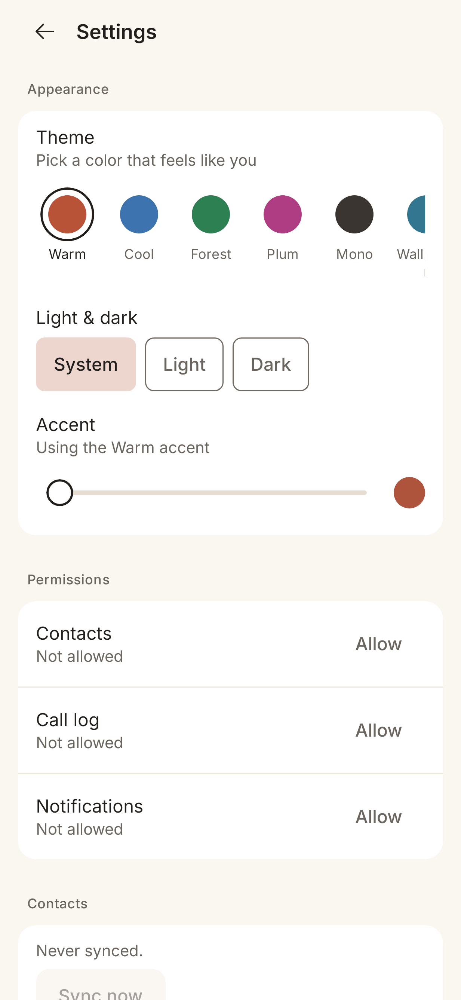

# Settings

> **Intent**: Trust and control. Settings exists to make the app's relationship with your data legible and adjustable: what permissions it has, what it has synced and how far back, how it makes its matching decisions, how it looks, and who you have chosen to ignore. For a local-only, privacy-first app, this screen is where the central promise ("everything stays on your phone") is either reinforced or quietly assumed.

**Mission tie**: Indirect but foundational. The core loop runs on contacts and call history; people only grant that access if they trust the app. Settings is where that trust is maintained.

---

## Today (as of 2026-10-05)

*JVM gallery render (`PreviewGalleryTest`, Robolectric, light, 411dp, font scale 1.0) at `783a964`, 2026-10-05, not a device capture (`SettingsScreen.SettingsContentPreview`, top of the scroll).*

Six sections, in this order:

- **Appearance**: **Theme** (Warm, Cool, Forest, Plum, Mono, and Wallpaper, which takes the phone's wallpaper hue through the same contrast-safe generator), **Light & dark** (System / Light / Dark) and an **Accent** dial ("Using the Warm accent", or a custom hue that can never fail contrast). Nothing draws until the saved values have loaded (SET-09).
- **Permissions**: Contacts, Call log, Notifications, each **Allowed**, **Not allowed** with an Allow action, or "Off in your phone's settings" with Open Android Settings.
- **Contacts**: "Last synced 5 minutes ago" or "Never synced." and **Sync now**.
- **Call history**: last synced and Sync now; **Import range** (1 month / 3 months / 6 months / 1 year); **Call history** (opens the log); **Groups when adding people** (where Commonly called, Rarely called, Recently added and Long gap begin; SET-10. It said "Picker thresholds · Edit chip-match thresholds" until 2026-10-05).
- **Data**: Export my data (encrypted JSON, password protected), Import backup (password, then a confirmation that counts what it replaces), Reset Orbit (with confirmation).
- **About**: a plain privacy line, "Everything stays on your phone: no cloud, no tracking." (SETTINGS-1, this round), the version, Send feedback, Privacy policy, Source code, Open source licenses.
- **Ignored** sits in the Call history group: "3 ignored" (or "No ignored contacts") opens a screen listing everyone hidden, each with **Unignore** and Undo, and the reassurance that history is kept.
- "Orbit couldn't load your settings" with Try again if reading fails.

Clean, honest and well scoped. In June the app's biggest selling point, privacy, was implied here but never stated; it now is.

---

## Where it's going

### `SETTINGS-1` · Say the privacy promise out loud · **Done 2026-10-05 (the settings package of this round)**
Orbit's defining choice is local-only, no cloud, no telemetry, and Settings is exactly where a privacy-minded user goes looking for reassurance. One plain line now sits at the top of About, the same sentence Welcome makes: "Everything stays on your phone: no cloud, no tracking." Free trust, and the honest thing to do where people expect to find it. The hosted privacy policy sits beneath it for the full story.

### `SETTINGS-2` · A global quiet-hours / notifications summary · **Later**
Nudges are configured per list, which is powerful but means there is no single place to see or dampen them all. A global "quiet hours" and a one-glance summary of "what will nudge you, when" would give a calm app a calm master volume knob.

### `SETTINGS-3` · Make "Ignored" feel like a recoverable choice · **Done 2026-10-05 (`0e58d7f`)**
Ignoring is a reversible decision, so its home in Settings makes the count visible ("3 ignored") and the way back one tap: **Unignore**, with Undo, on a screen that says history is kept. Ignoring never feels like a one-way door.
