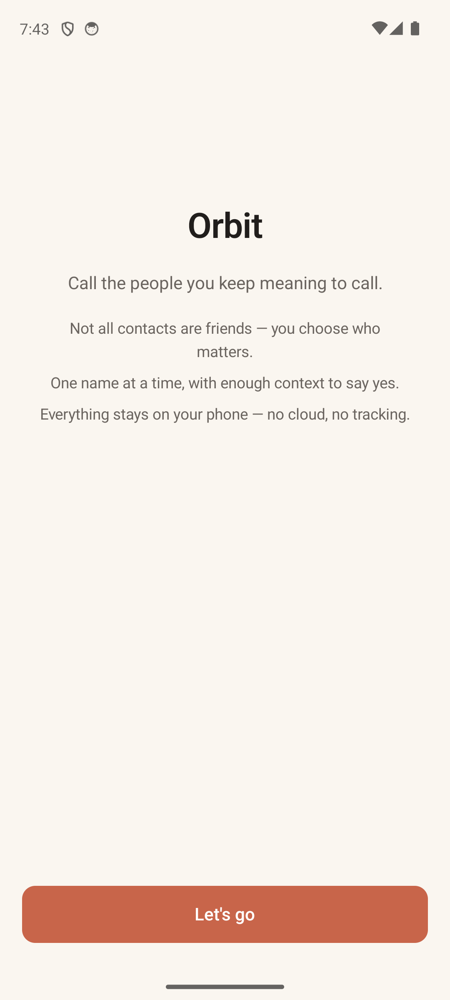
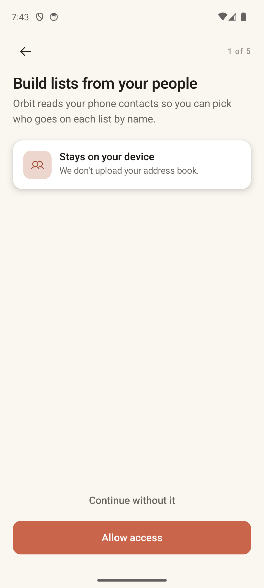
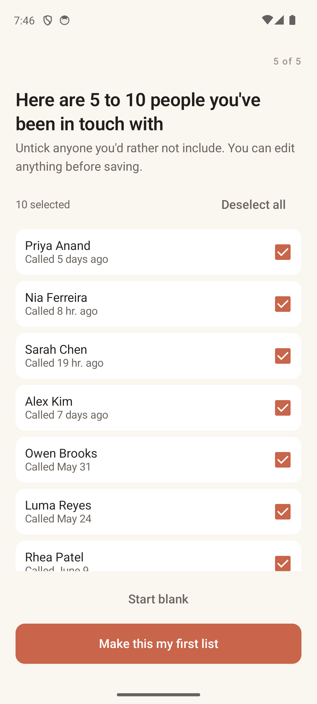
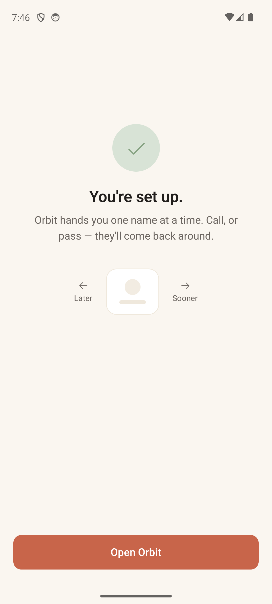

# Onboarding

> **Intent** — Earn trust, get the permissions the loop needs, and leave the user holding *one real list* and *the gesture in their hands*. Onboarding exists to convert a cold install into an activated user — someone who has felt the core loop once — while being scrupulously honest about why each permission is asked for. It must never feel like a gate; it should feel like being shown around.

**Mission tie** — Activation. A user who finishes onboarding with a populated list and an understanding of Later/Sooner is one who can experience "one name at a time, with enough context to say yes" on day one.

---

## Today

The flow: **Welcome** → **Contacts** permission → **Call log** permission → **Notifications** permission → **Sync** ("Reading your call history…") → **Preview** (a recency-based list of "people you've been in touch with," all pre-checked, untick to exclude) → **First list** (reuses the production List Config) → **Done**.

Notable strengths already in place:
- Each permission screen pairs the ask with a **"stays on your device"** promise and an honest denied-state path ("You can still create lists…").
- Sync is a calm, non-skippable gate with a live count and a graceful empty/failed handling.
- The **Preview** screen does the activation magic — it hands you a ready-made first list from your own call history.
- **Done** teaches the swipe in muted tones (a mini card with "Later ←" / "→ Sooner").

This is a strong, considered flow. Suggestions are additive, not corrective.

---

## Where it's going

### `ONB-1` · Carry "context" into the preview · **Next**
The Preview screen already shows last-call recency per person. Where a note or memorable detail exists, show it too — the same "context, not just logistics" thesis as `CARD-1`. The first time someone sees Orbit's list, "Maria — you last talked about her move" sells the entire product in a glance far better than "Maria — 3 weeks ago."

### `ONB-2` · End on the loop, not just "Open Orbit" · **Later**
"Done" hands the user back to Home. Consider letting the very first action out of onboarding be a single card — drop them straight into the loop they just built (or a one-tap "Surprise me," `HOME-1`) so the first thing they *feel* is the payoff, not a menu.

### `ONB-3` · Keep it honest as features grow · **Ongoing**
As `CARD-4` ("reached another way"), nicknames (`X-3`), and others land, fold the smallest necessary mention into onboarding without bloating it. The flow's current discipline — one idea per screen, a promise with every ask — is the thing to protect. New steps must clear a high bar.
