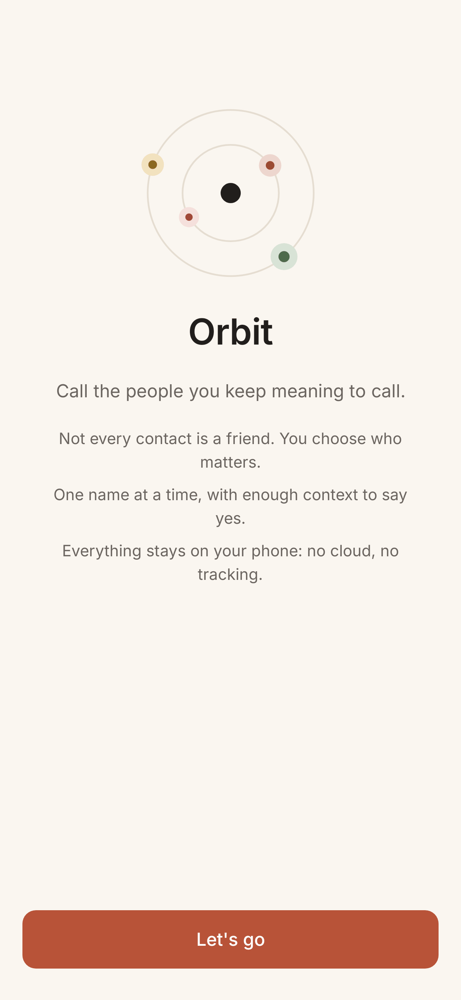
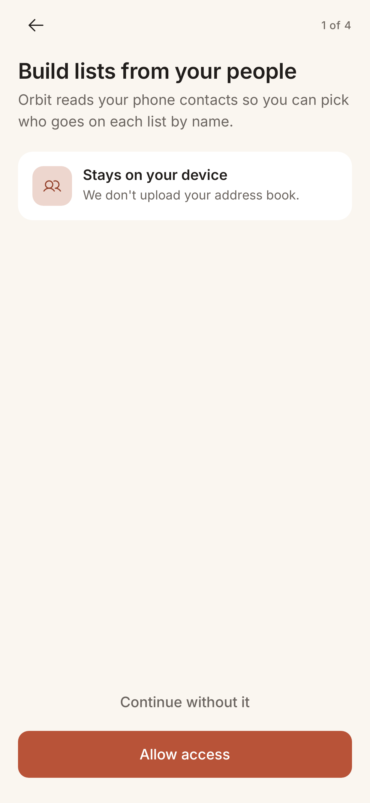
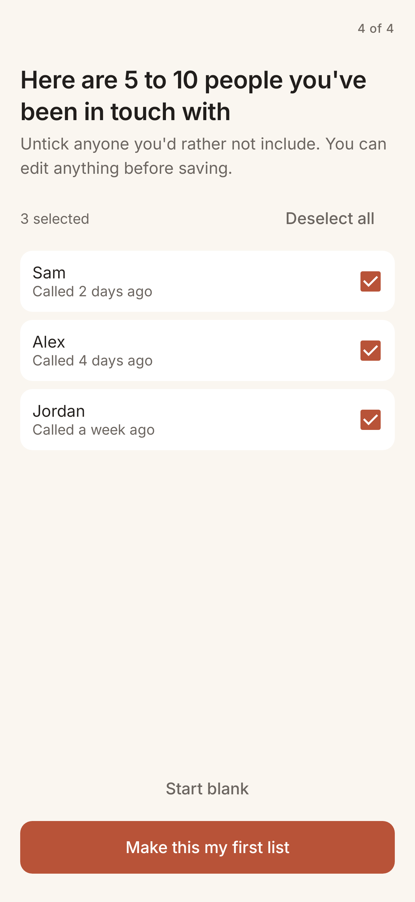
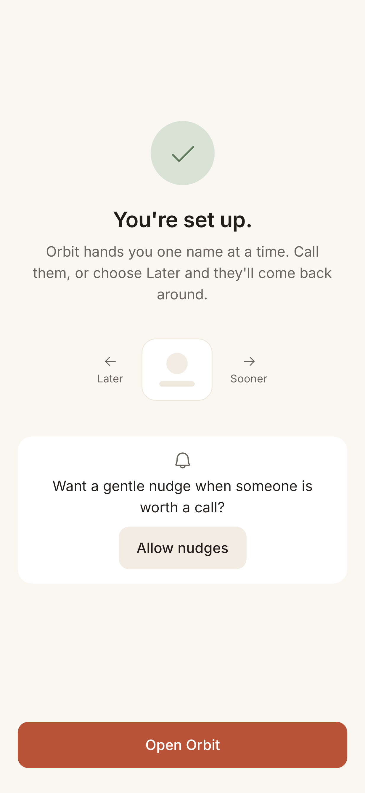

# Onboarding

> **Intent**: Earn trust, get the permissions the loop needs, and leave the user holding *one real list* and *the gesture in their hands*. Onboarding exists to convert a cold install into an activated user, someone who has felt the core loop once, while being scrupulously honest about why each permission is asked for. It must never feel like a gate; it should feel like being shown around.

**Mission tie**: Activation. A user who finishes onboarding with a populated list and an understanding of Later and Sooner is one who can experience "one name at a time, with enough context to say yes" on day one.

---

## Today (as of 2026-10-05)

*JVM gallery render (`PreviewGalleryTest`, Robolectric, light, 411dp, font scale 1.0) at `783a964`, 2026-10-05, not a device capture (`OnboardingWelcomeScreen`, `OnboardingPermContactsScreen`, `OnboardingPreviewScreen` and `OnboardingDoneScreen` previews).*

The flow: **Welcome** (the Orbit mark settles into place, ONB-31) → **Contacts** permission (1 of 4) → **Call log** permission (2 of 4) → **Sync** ("Reading your call history", 3 of 4) → **Preview** (4 of 4: a recency-based list of "people you've been in touch with", all ticked, untick to exclude) → **First list** (4 of 4; the production List settings body) → **Done**, which asks about nudges in context (ONB-30). Two permission screens, not three: notifications are asked on Done, after the first list exists, with "Allow nudges"; answered, the ask becomes a plain line.

Notable strengths in place:
- Each permission screen pairs the ask with a **"Stays on your device"** promise and an honest denied-state path ("You can still create lists…"); "Continue without it" confirms with "Skip for now?" and names what is lost.
- Sync is a calm, non-skippable gate with a live count and graceful empty, skipped and failed handling.
- The **Preview** screen does the activation magic: a ready-made first list from your own call history.
- **Done** teaches the swipe in muted tones (a mini card flanked by "Later" and "Sooner"), then asks for nudges once, with the first list already made.

A strong, considered flow, shorter than in June. Suggestions are additive, not corrective.

---

## Where it's going

### `ONB-1` · Carry "context" into the preview · **Next**
The Preview screen shows last-call recency per person ("Called 2 days ago"). Where a note or memorable detail exists, show it too: the same "context, not just logistics" thesis as `CARD-1`. The first time someone sees Orbit's list, "Maria, you last talked about her move" sells the entire product in a glance far better than "Maria, 3 weeks ago." (On a fresh install there are no notes yet, so this mostly pays off on a reinstall or an import.)

### `ONB-2` · End on the loop, not just "Open Orbit" · **Later**
"Done" hands the user back to Home. Consider letting the very first action out of onboarding be a single card: drop them straight into the loop they just built, so the first thing they *feel* is the payoff, not a menu. (The earlier alternative, a one-tap "Surprise me", went with `HOME-1`.)

### `ONB-3` · Keep it honest as features grow · **Ongoing**
As `CARD-4` ("reached another way"), nicknames (`X-3`) and others land, fold the smallest necessary mention into onboarding without bloating it. The flow's current discipline (one idea per screen, a promise with every ask, the nudge question asked only once there is something to nudge about) is the thing to protect. New steps must clear a high bar.
