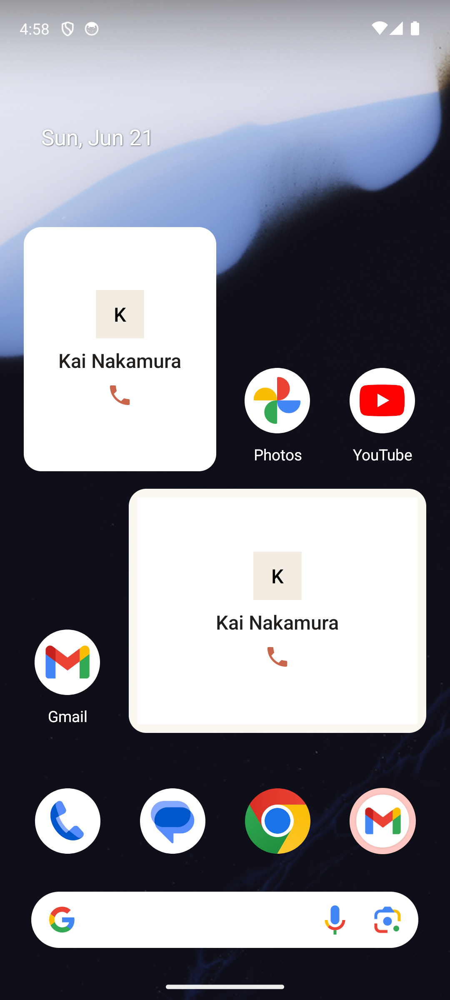

# Widgets

> **Intent** — The loop without opening the app. The home-screen widgets exist to bring Orbit's core promise — one name, ready to call — to the place the user already looks a hundred times a day. A widget that surfaces a person and lets you act is the shortest possible path from "I have a free minute" to "I called someone I'd been meaning to." It's Orbit at its most ambient.

**Mission tie** — The lowest-friction possible expression of the mission. No app launch, no navigation — the answer to "who should I call?" is already on the home screen.

---

## Today

- A **2×2** and a **4×2** widget exist, each surfacing a single person with name, avatar, and a **call** affordance.
- They reflect the same one-person-at-a-time philosophy as Card View, on the home screen.

The foundation is right. The opportunity is to make the widget a place you can *act and advance*, not just glance.

---

## Where it's going

### `WIDGET-1` · Act from the widget · **Next**
Bring the card's controls to the 4×2: **Call**, plus **Later** / **Sooner**, directly on the widget. That makes the home screen a fully functional one-card surface — surface, call (or defer), advance — without ever opening the app. This is the single biggest multiplier on the widget's value.

### `WIDGET-2` · A "Surprise me" widget · **Later**
A variant that, on tap, hands you a random *due* person across all lists (`HOME-1`'s logic, on the home screen). The most ambient possible version of the loop: one tap from your launcher to one name to call.

### `WIDGET-3` · Carry context onto the larger widget · **Later**
Where space allows (the 4×2), echo `CARD-1` — show the why-now line or the last note, so the widget answers "why them?" not just "who." The same context that earns a yes inside the app earns it on the home screen.
