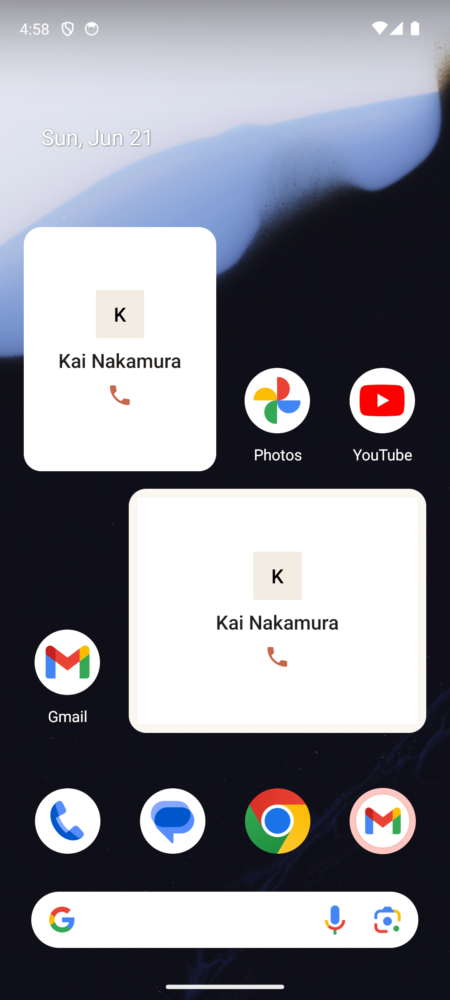

# Widgets

> **Intent**: The loop without opening the app. The home-screen widgets exist to bring Orbit's core promise, one name ready to call, to the place the user already looks a hundred times a day. A widget that surfaces a person and lets you act is the shortest possible path from "I have a free minute" to "I called someone I'd been meaning to." It is Orbit at its most ambient.

**Mission tie**: The lowest-friction possible expression of the mission. No app launch, no navigation: the answer to "who should I call?" is already on the home screen.

---

## Today (as of 2026-10-05)

*The image is the June 2026 device capture. The shipped widgets are rendered by `PlatformSurfacesGalleryTest` (`-Pscreenshots`), light and dark, at every breakpoint; `features/widgets/README.md` is canonical.*

- Two widgets: **Next call** (placed at 2×2) shows the one person Orbit would suggest next across every list; **Call suggestions** (4×2) shows the lead and up to two more, as a static list. Both pick people the way Card view would (`WidgetSurfaceUseCase`).
- **Every size has an arrangement** (WIDGET-07): from one row (face and a round Call button) to a large card, with a full 48dp Call at each.
- **Only Call dials** (WIDGET-08, as CARD-01 inside the app): the lead's labelled accent **Call** button opens the dialer; a tap anywhere else on a person opens their list's deck in Orbit, with them on top. The others carry a quiet, muted phone button where there is room.
- **The app's avatar** (WIDGET-11): the address-book photo, else the same two-letter monogram on the same palette colour, always a circle; the widget is a card in the theme's surface colour with Android's own corner radius, following the user's theme, accent and light or dark choice.
- **Empty state** (WIDGET-10): "All quiet for now." under the Orbit glyph; a tap opens Orbit. Never "caught up" or "no one due".
- Real previews in the widget picker (WIDGET-09). Names and faces show (the home screen is behind the phone's lock); a list name never does.
- A long-press on the app icon offers **Call next** and **Search** (LAUNCH-01), with fixed words that name no one.

The foundation this file hoped for in June is built. What remains is context, not controls.

---

## Where it's going

### `WIDGET-1` · Act from the widget · **Declined 2026-10-05**
This proposed Later and Sooner on the 4×2. Decided against (`features/widgets/README.md`, Not in scope): they change the deck, and a widget has nowhere to offer Undo, which every move inside the app carries (CARD-02). Call is on the widget because a call needs no undo path; a tap on the person opens the deck, where Later and Sooner are one tap away with their snackbars.

### `WIDGET-2` · A "Surprise me" widget · **Cut with `HOME-1`**
Its premise, a random person across all lists, was cut from the app because randomness fought the model. "Next call" already hands you the *ranked* next person across every list, which is the honest version of the same ambition.

### `WIDGET-3` · Carry context onto the larger widget · **Later**
Where space allows (the 4×2 and up), echo `CARD-1`: show the why-now line or the last note, so the widget answers "why them?" not just "who". The same context that earns a yes inside the app earns it on the home screen. Names are already on the widget; a note body would need the same privacy judgement (`features/privacy-and-lock/README.md`, "Surfaces outside the app").
