# Before and after

The same `@Preview`s rendered by the JVM preview gallery (`PreviewGalleryTest`) at the start of the UX work (`df3b41b`, the [rubric baseline](../ux-rubric.md#baseline-before-the-work)) and at the end (`2cf083b`). Left is before, right is after, on the same 411dp phone. Most previews kept their fixture data, so the differences are the work; where a preview's data changed, the row says so.

These are JVM renders, not device screenshots: the fonts, colours and layout are real Compose output, but nothing here was captured on a phone. The rubric's [re-score](../ux-rubric.md#re-score-after-the-work) has the full evidence.

| Screen | What the pair shows |
|---|---|
| [Home](#home) | A labelled Call button for the next person (HOME-9) where a chevron only repeated that the card is tappable; the Lists icon is a bulleted list, not a hamburger; the reason line in sentence case. |
| [Home, dark](#home-dark) | The same, in dark mode. |
| [Home, 200% text](#home-200-text) | At 200% the list name and "Next up" stack instead of clipping in a fixed column. |
| [Card view](#card-view) | "Due today" in sentence case; the menu is three dots; the card leads with the pair's rhythm and the last note (CARD-04); Later and Sooner are named (CARD-02); a deeper terracotta Call button that passes 4.5:1. |
| [Card view, dark](#card-view-dark) | The same, in dark mode, with the dark Call button's darker label. |
| [Card view, 200% text](#card-view-200-text) | The face scrolls instead of crushing its contents. |
| [Contact detail](#contact-detail) | Stats in words where there is no data yet, and plain labels. |
| [Lists](#lists) | One way to create a list: the app bar's "+" is gone, leaving New list (LIST-20). |
| [List settings](#list-settings) | "Cadence" is now "Rhythm"; the selected option is ink, so Done stays the screen's one accent (Design 5). |
| [Settings](#settings) | A sixth theme, Wallpaper (the row scrolls); outlined Light and Dark choices; Orbit's slider, which TalkBack reads in words. |
| [Welcome](#welcome) | The Orbit mark, which settles into place once (ONB-31); the copy without em dashes. |
| [Onboarding done](#onboarding-done) | "Later" instead of "pass", one word for one action; the nudge ask (ONB-30) starts below the fold. |
| [Browse](#browse) | Orbit's filter chips, and the list grouped "Up next" and "Everyone else". The preview gained people since the baseline. |
| [Call history](#call-history) | Orbit's filter chips with a check on the selected one, where three chip styles had grown up. |

## Home

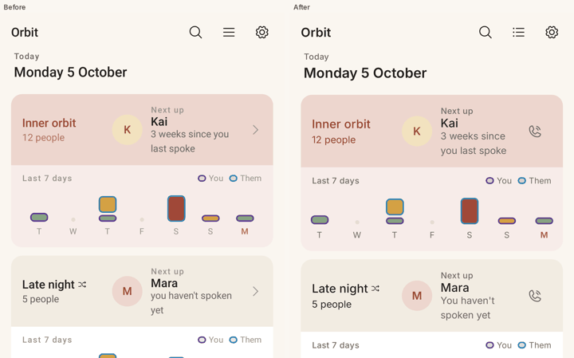

## Home, dark

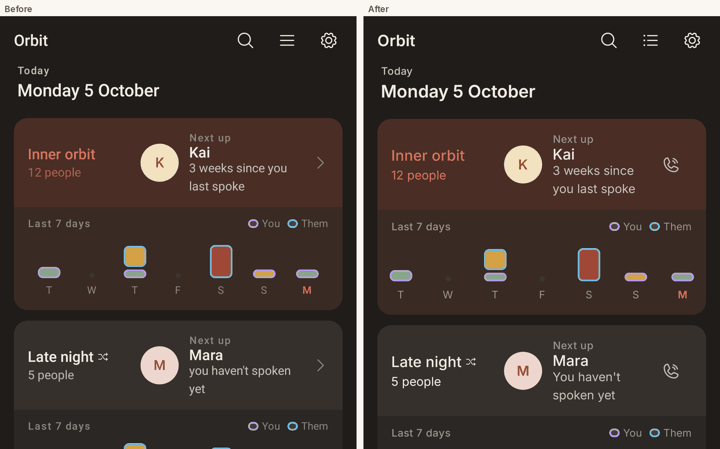

## Home, 200% text

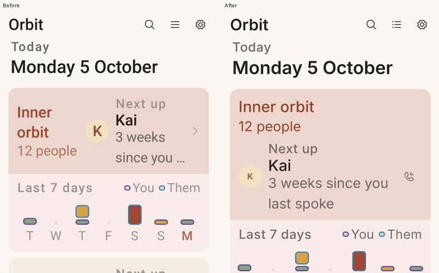

## Card view

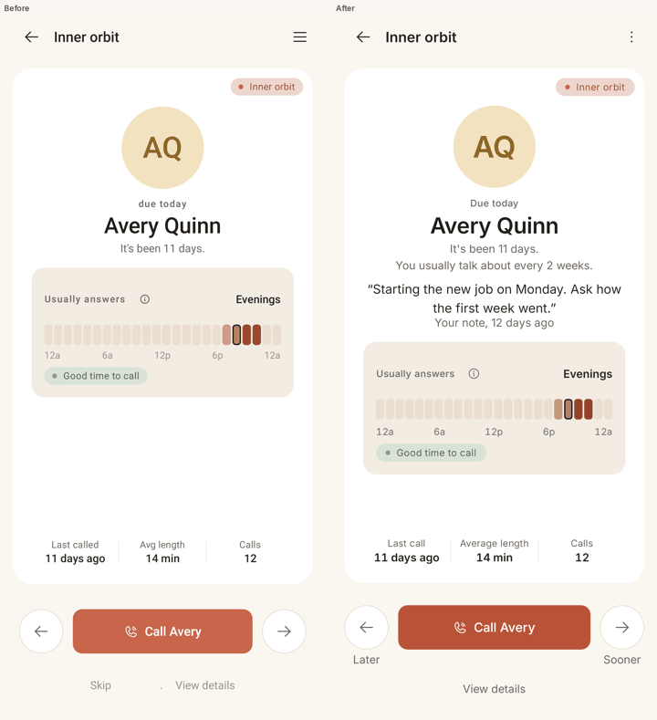

## Card view, dark

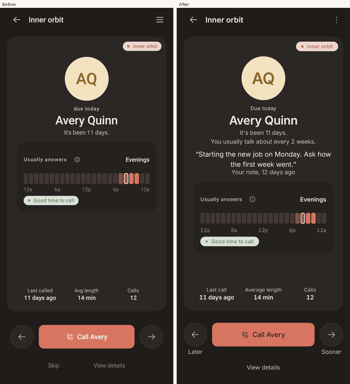

## Card view, 200% text

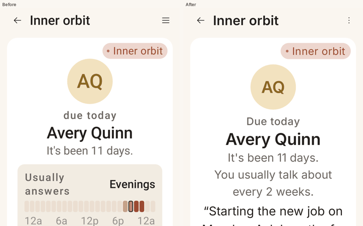

## Contact detail

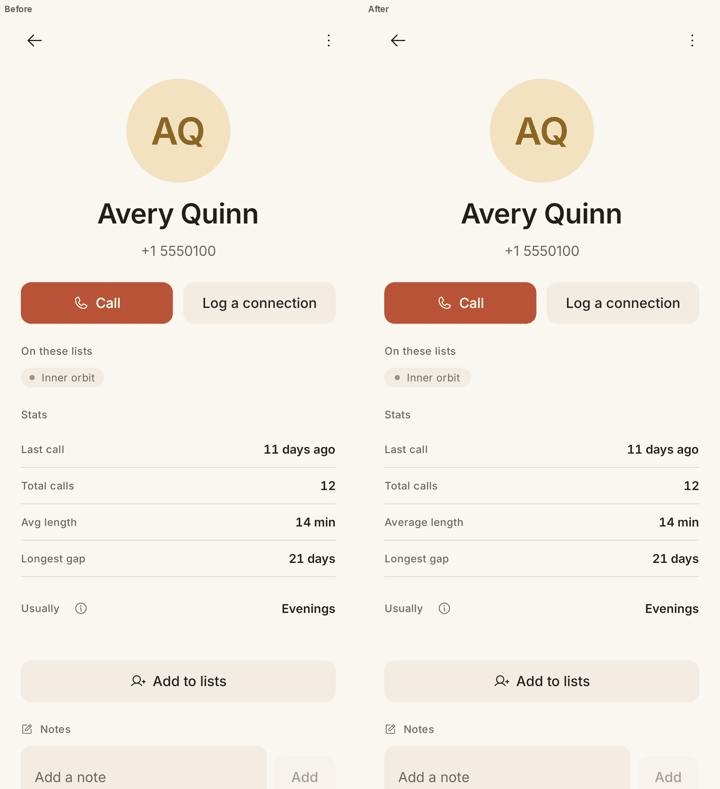

## Lists

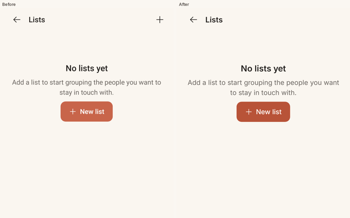

## List settings

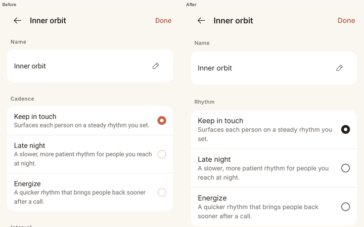

## Settings

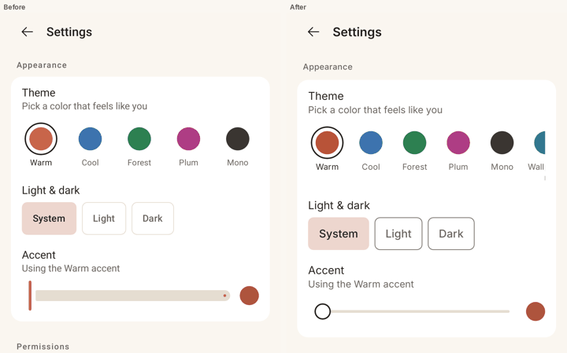

## Welcome

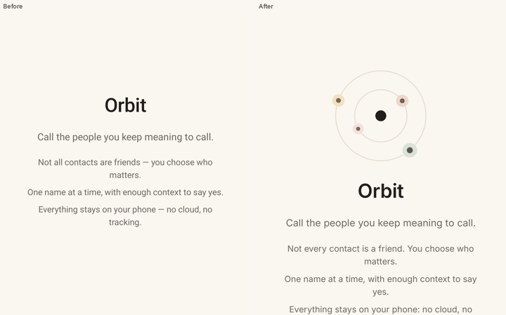

## Onboarding done

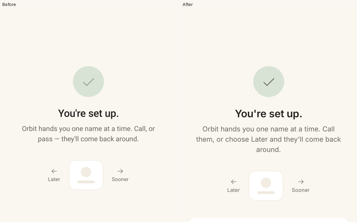

## Browse

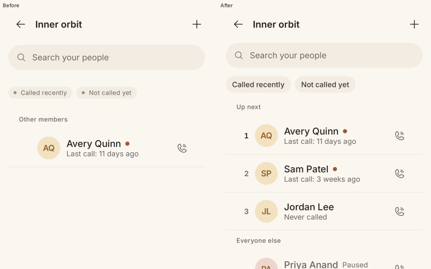

## Call history

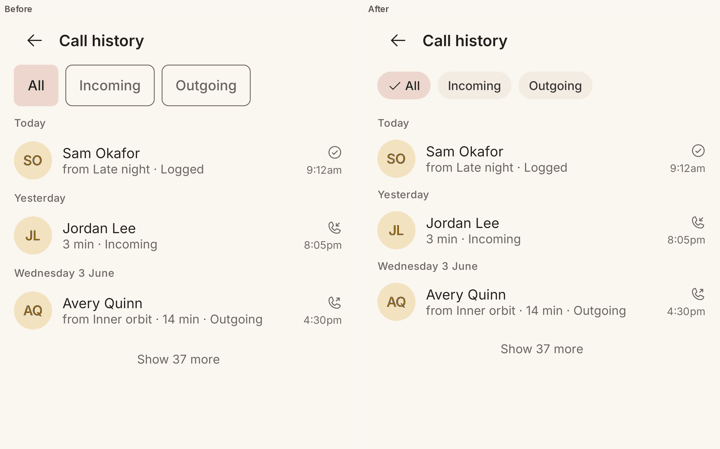

