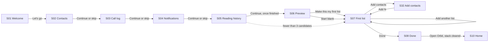
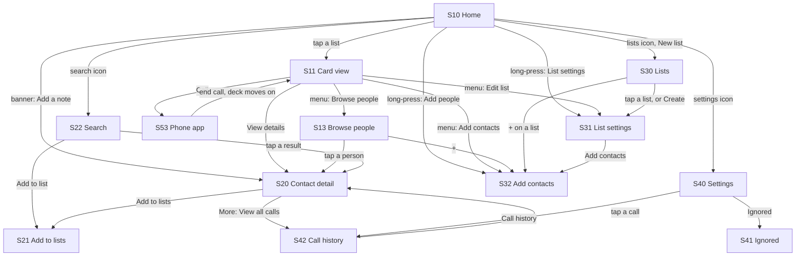
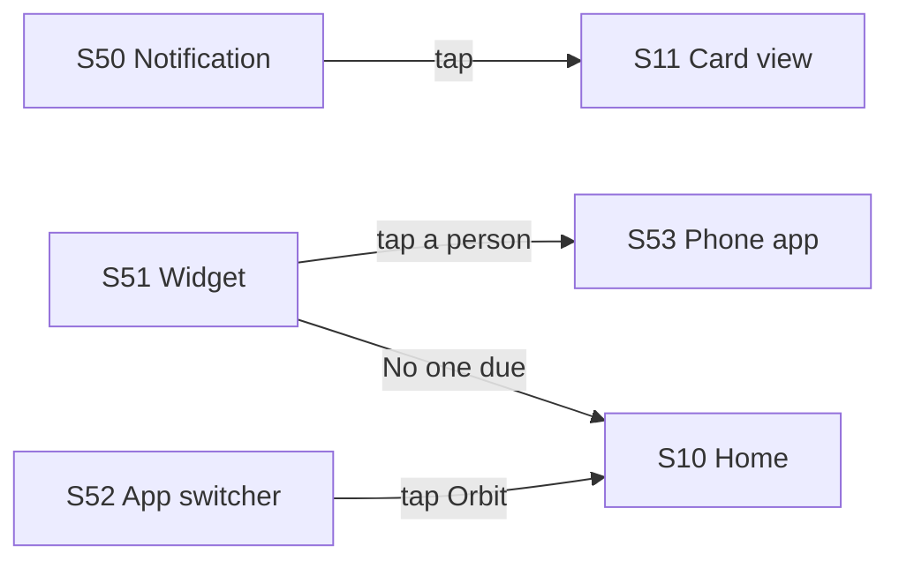

# Flows

> **Intent:** one place to see every screen and every journey through Orbit as it ships today, click through it like the real app, and leave feedback that names exactly which screen and state it is about. This is the review surface for changing the *flow*, not the visuals of any one screen.

**Prototype:** [`prototype/index.html`](prototype/index.html). One self-contained file; open it in any browser. No build step, no server.

**Published copy:** https://claude.ai/artifact/XVatbjrA7kJ2VzvvwkWimp (private to its owner until shared). Notes left there are saved to the page.

**Built from:** the Compose source at commit `15b6bfb` (2026-10-04), read screen by screen. Copy is verbatim from the code, with one exception: the app uses em dashes in about a dozen strings, and the prototype shows those as a spaced hyphen. Data is the synthetic cast from `android/scripts/seed-avd.py` plus a few invented address-book names. Nothing here is a real contact.

---

## How to use it

The prototype has four views, switched from the top bar:

| View | What it is for |
|---|---|
| **Prototype** | A phone you can tap through. Long-press works where the app has it (right-click also works). Swipe the card left or right. The panel on the right shows the screen's ID, every state you can open directly, where it leads, where it is reached from, what it owes the user, and any gap between the docs and the code. |
| **Flows** | Ten journeys, step by step. The control to press next is outlined in blue. Use Next step, the arrow keys, or just tap the outlined control. |
| **Map** | Every screen at once, laid out by area, with where each one leads. Click any screen to open it. |
| **Feedback** | Every note you have left, grouped by journey and screen, with **Copy as markdown**. |

**Blue is the review layer.** Anything blue (tap-target outlines, flow cues, the feedback panel) is part of the review tool, never part of the app. The phone uses Orbit's own tokens from `design/colors_and_type.css`, in light or dark to match the page.

**Leaving feedback.** Every note records the screen ID, the state you were looking at, and a kind (Change, Question, or Works). In the Flows view you can attach a note to the whole journey instead of one screen. Where notes are kept depends on how you opened the prototype:

- **The published copy on claude.ai** saves notes to the page itself, so Claude can read them back and work through them.
- **This file opened locally** saves notes in that browser only. Use **Copy as markdown** on the Feedback view to move them anywhere.

Either way, the markdown export uses the IDs below, so a note like "S11, Ready: move Skip next to the arrows" is unambiguous.

---

## Screen inventory

IDs are stable handles for feedback. They are local to this document and the prototype; they are not requirement IDs.

### First run

| ID | Screen | Route | Spec |
|---|---|---|---|
| S01 | Welcome | `onboard/welcome` | [page view](../../features/page-views/onboarding-welcome.md) |
| S02 | Contacts permission | `onboard/permissions/contacts` | [page view](../../features/page-views/onboarding-permissions.md) |
| S03 | Call log permission | `onboard/permissions/call-log` | [page view](../../features/page-views/onboarding-permissions.md) |
| S04 | Notifications permission | `onboard/permissions/notifications` | [page view](../../features/page-views/onboarding-permissions.md) |
| S05 | Reading your call history | `onboard/sync` | [page view](../../features/page-views/onboarding-sync.md) |
| S06 | Preview your first list | `onboard/preview` | [page view](../../features/page-views/onboarding-preview.md) |
| S07 | Make your first list | `onboard/first-list/{listId}` | [page view](../../features/page-views/onboarding-first-list.md) |
| S08 | Done | `onboard/done` | [page view](../../features/page-views/onboarding-done.md) |

### Daily loop

| ID | Screen | Route | Spec |
|---|---|---|---|
| S10 | Home | `home` | [page view](../../features/page-views/home.md) |
| S11 | Card view | `card/{listId}` | [page view](../../features/page-views/card-view.md) |
| S13 | Browse people (includes the queue) | `browse/{listId}` | [page view](../../features/page-views/browse.md) |

### People

| ID | Screen | Route | Spec |
|---|---|---|---|
| S20 | Contact detail | `contact/{contactId}` | [page view](../../features/page-views/contact-detail.md) |
| S21 | Add to lists (reverse picker) | `pick/lists` | [page view](../../features/page-views/picker-lists.md) |
| S22 | Search | `search` | [page view](../../features/page-views/search.md) |

### Lists

| ID | Screen | Route | Spec |
|---|---|---|---|
| S30 | Lists | `lists` | [page view](../../features/page-views/lists-manager.md) |
| S31 | List settings | `lists/{listId}/config` | [page view](../../features/page-views/list-config.md) |
| S32 | Add contacts (contact picker) | `pick/contacts` | [page view](../../features/page-views/picker-contacts.md) |

### Settings and records

| ID | Screen | Route | Spec |
|---|---|---|---|
| S40 | Settings | `settings` | [page view](../../features/page-views/settings.md) |
| S41 | Ignored | `settings/ignored` | [page view](../../features/page-views/ignored-contacts.md) |
| S42 | Call history | `call-log` | [page view](../../features/page-views/call-history.md) |

### Outside the app

| ID | Surface | Where | Spec |
|---|---|---|---|
| S50 | List nudge notification | lock screen, shade | [notifications](../../features/notifications/README.md) |
| S51 | Home screen widgets (2x2 and 4x2) | launcher | [widgets](../../features/widgets/README.md) |
| S52 | App switcher (privacy curtain) | recent apps | [privacy](../../features/privacy-and-lock/README.md) |
| S53 | Phone app | system dialer | [card view](../../features/card-view/README.md) |

Each screen's states (sheets, dialogs, menus, empty and error states) are listed in the prototype's right panel and can be opened directly. There are 109 in total.

---

## Flow maps

### First run



### Inside the app



### From outside the app



---

## Journeys

Each journey is playable in the Flows view. Order matters within a journey, so the steps are numbered.

**F1. First run, from install to Home.** Three permissions, a blocking sync, a suggested list, and a required first list before Home.
1. S01 Welcome, Let's go.
2. S02 Contacts: the reason shows before Android's own dialog. Allow, or continue without it (a "Skip for now?" dialog confirms).
3. S03 Call log, same pattern.
4. S04 Notifications, same pattern (skipped entirely on Android 12 and older).
5. S05 Reading your call history: Continue stays disabled until the read finishes.
6. S06 Preview: up to 10 people you already call, all ticked.
7. S07 Make your first list: Done needs a name and at least 3 people.
8. S08 Done, then Home with the onboarding back stack cleared.

**F2. Call someone from a list.** The core loop.
1. S10 Home, tap a list card.
2. S11 Card view, Call.
3. S53 Phone app opens with the number filled in; you press call there.
4. End the call and come back: S11 has already moved to the next person, with no prompt.
5. Back to S10: within 10 minutes of the call, a banner offers "Add a note".
6. S20 Contact detail opens with the note field focused.

**F3. Decide on the card: later, sooner, browse.** Swipe left, the left arrow, and Skip all mean Later; swipe right or the right arrow mean Sooner. Each shows a snackbar with Undo. The list menu leads to S13, where the numbered queue lives. If no one is eligible, S11 says so and offers Browse.

**F4. Start a new list.** S10 New list, S30 template sheet, Create, S31 List settings (saves as you go), S32 Add contacts, back to S31 with "Added 3 to Family", Done to S30.

**F5. Tidy a list in bulk.** S13, long-press a row, Select, tap more rows, Move to which list, snackbar with Undo.

**F6. Find someone and file them.** S10 search icon, S22 type a name, Add to list, S21 tick lists, back to S22 with "Added to 1 list".

**F7. Take a break from someone.** S20 More, Pause, pick a length (snackbar with Undo). When a timed pause ends, S20 shows an unpause banner. Ignored people are restored from S41 under Settings.

**F8. Look back at a call.** S10 Settings, S40 Call history, S42 tap a call, S20 opens with a note box under that call.

**F9. Nudged from outside the app.** S50 notification taps through to S11. S51 widgets tap straight through to S53, skipping Orbit. S52 shows "List" and "Someone" in the app switcher.

**F10. Back up, restore, or start over.** S40 Export (password twice), Import (password, then a final confirmation), Reset Orbit (restarts at S01).

---

## Docs vs code

Reading the code against `features/PAGE_VIEWS.md` and the feature specs turned up these gaps. The prototype follows the code in every case. None of these docs were changed here.

| Where | The docs say | The code does |
|---|---|---|
| S10 Home | "N people ready" header, due-count pills on tiles, a "Surprise me" button, "All caught up" | None of these. Surprise me was removed ([ADR 0007](../../features/_foundations/ADRs/0007-surprise-me-cross-list.md) superseded). Cards show "Next up" plus a 7-day rhythm strip. Home never shows a caught-up state. The screenshot in `00-home/` predates this. |
| Up next / Queue | Its own screen, `queue/{listId}` ([page view](../../features/page-views/queue.md)) | No such route. The numbered queue is part of S13 Browse. |
| S11 Card view | A "Pickup" stat | Last called, Avg length, Calls. Tapping anywhere on the card face also dials. |
| S20 Contact detail | Usual answer time among the stats | Always shows a blank: the screen never computes it, though S11 shows it for the same person. Paused and ignored people look no different here. |
| S01 Welcome | "Who made it" and in-screen feedback email | Neither. Feedback lives in Settings, About. |
| S13 Browse | Row tap opens the person; long-press opens quick actions | Code reading suggests the row's own inert tap handler may swallow both. Not verified on a device. |
| S31 List settings | No mention | A Nudges section (days and times) and a Done exit both ship. |
| S32 Add contacts | Add, Move, Copy modes; "Skip for now" during onboarding | Only Add is reachable. Skip for now never shows. Re-link from S20 opens plain Add mode. |
| S42 Call history | A plain chronological list | Adds All, Incoming, Outgoing filters, sticky day headers, and a long-press menu. |
| S40 Settings | No mention | Appearance (five themes, light and dark, an accent dial) and Import backup ship. |
| S50 Notifications | Daily digest, time-of-day prompts, incoming follow-up | Only one notification exists: the per-list nudge. |
| S51 Widgets | Listed as a stub in `features/INDEX.md` | Both widgets ship. They always show real names. |
| S52 Privacy curtain | Names hidden when the app loses focus | Mostly. The card face name, the phone number on S20, and "from {list}" in S42 stay visible; notifications and widgets ignore it. |
| Copy | [voice.md](../../features/_foundations/voice.md) | About a dozen strings join two clauses with an em dash, for example the defer snackbar and the call-log notice on S11. The prototype shows a spaced hyphen there. |

---

## Feedback format

When writing feedback outside the prototype, lead with the ID and state so it can be acted on without a screenshot:

```
S11, Ready: Skip and the left arrow do the same thing. Keep one.
F2, step 5: I expected a "Did you talk?" prompt before the deck moves on.
S30: Two "new list" buttons on one screen. Drop the app bar +.
```

---

## Maintaining this

- **When a screen changes**, update its render function in `prototype/index.html` (each screen is one `screen({...})` block, in the same order as the inventory above), its row here, and any journey step that passes through it.
- **When a doc gap above is fixed** in `features/`, delete its row.
- **The prototype is a review tool, not a spec.** `features/` stays canonical for what the app should do; the code stays ground truth for what it does.
