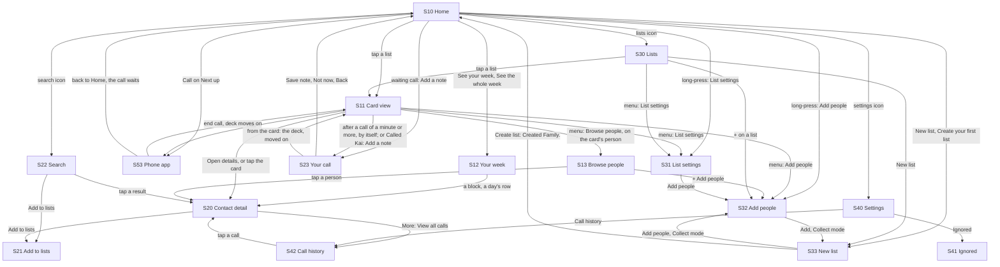
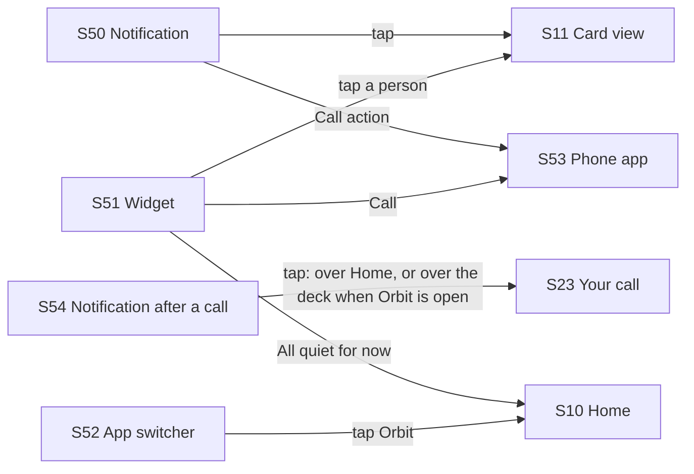

# Flows

> **Intent:** one place to see every screen and every journey through Orbit as it ships today, click through it like the real app, and leave feedback that names exactly which screen and state it is about. This is the review surface for changing the *flow*, not the visuals of any one screen.

**Prototype:** [`prototype/index.html`](prototype/index.html). One self-contained file; open it in any browser. No build step, no server.

**Published copy:** https://claude.ai/artifact/XVatbjrA7kJ2VzvvwkWimp (private to its owner until shared). Notes left there are saved to the page.

**Bugs found while building it:** [findings.md](findings.md) lists 14, from smart lists that never surface anyone to an indefinite pause that cannot be undone. All 14 were fixed on 2026-10-05 (B14 in part), and the prototype now shows the fixed behaviour. Each bug still shows on its screen in the prototype's side panel, marked fixed, with what changed.

**Built from:** the string resources (`android/app/src/main/res/values/strings_*.xml`) and the Compose source at commit `ce41756` (2026-10-08), screen by screen; first built from `15b6bfb` (2026-10-04), re-derived on 2026-10-05, again on 2026-10-07 as the app took the owner's review ([owner-review-2026-10-07.md](owner-review-2026-10-07.md)): the first round at `12df9c7`, then the Week screen at `80a4ab6`, then the step-by-step New list at `7f38fe1`, then the card at `e1e21a3`, then the Contact detail schedule and the note page's withdrawn notification at `cb23e87`; and on 2026-10-08 for main's PR #14 (merged into this branch in `d4d3b61`: the number wheel, [ADR 0011](../../features/_foundations/ADRs/0011-number-wheel-for-day-and-count-settings.md), and the one text field, [ADR 0012](../../features/_foundations/ADRs/0012-text-fields-stay-in-place-above-the-keyboard.md)) and the audit fixes merged from `5e0ab55` to `ce41756`; then, later that day, the retirement of Time of day for one nudge-timing section (LIST-25). Copy is verbatim from the strings.

The 2026-10-08 pass shows:

- **One place for a list's nudge timing (S31, S07):** the "Time of day" section is gone from List settings and Make your first list, after the owner's comment on the republished prototype that two nudge timing sections were confusing (LIST-25; the decision is at the end of [owner-review-2026-10-07.md](owner-review-2026-10-07.md)). "When to nudge" alone sets the days and times, and its line says them as they are ("Every day at 10am"). A list that had a time of day keeps nudging when it did: the app folds the old window into the list's times. The Evenings and Custom states went with it.
- **How often is a number wheel (S31, S33, S20, S07):** "Aim for every 14 days" over a sideways row of days from 1 to 60 that drags, flicks and snaps, with "1 week", "2 weeks", "3 weeks", "1 month" and "2 months" under those days; one day reads "Aim for every day". A tap on a number brings it to the centre, the arrow keys step it, and it writes once it comes to rest (ADR 0011). The smart rule's setting in List settings ("Added in the last 30 days", 7 to 180) and Settings' "Groups when adding people" are wheels too, under their sentences.
- **One text field (S07, S20, S21, S30, S31, S33, S40, and the Log a connection sheet):** a box in the quiet fill outlined in fgSubtle, its label above it where it has one, a 2px ink ring and an ink cursor when focused, never the accent (ADR 0012). The note page's field stays page-style, now with the ink cursor.
- **Add people (S32):** the commit bar says "Add" (TalkBack hears "Add 3 people to In touch"); "Recently added" is a filter chip again, second after Starred; an archived list is never named on a row. **Add to lists (S21)** uses the same docked bar, "Add" (TalkBack: "Add to 1 list").
- **List settings (S31):** the time picker says "Choose a time" and has a keyboard button, "Type the time", then "Use the clock" (a new state shows the typed hours); a smart list's People section says "Orbit fills this list from its rule. To keep someone off it, ignore them."; while renaming there is no Done at the foot either.
- **Settings (S40):** Light, Dark and System are one radio group, the chosen chip checked.
- **Card view (S11):** the Later and Sooner circles carry "Later" and "Sooner" under them, as in the app. Every "when" counts calendar days from the move itself, and Later and Sooner move a turn as the app's use cases do: Later on someone up now says "Tomorrow" in the hint and the snackbar ("Later · Tomorrow", "Kai will come up again tomorrow."), and Sooner on them "Today" ("Sooner · Today", "Luma comes up later today."); a connection logged now on a 2-day list names the day after tomorrow, Tuesday. The idle hints wait while the list menu is open and start their four seconds again when it closes.
- **Browse (S13):** the "when" labels count calendar days, so Jamie, due tomorrow at 8:30am, an hour earlier than now, reads "Tomorrow", and Sarah, Thursday at 8:30am, "Thursday". One snackbar at a time: a new state shows two drops in a row, where the newer snackbar has replaced the first and its Undo puts back only its own drop.
- **Home (S10):** each bar on a crowded day keeps its place in the day's column (rhythmBars): a new "Busy days on the strip" state shows 40 then 5 minutes, 30, 3 and 3, and five calls on one day, every call with a bar, its outline and some of its colour, a longer call never shorter.
- **New list (S33):** while Create writes, the step holds still (a new state; after "Create list" the prototype holds it for a moment): the footer, Close, Back, Add people, each remove and the How often wheel wait. After Create, Lists (S30) brings the new list into view.
- **The note page (S23) and the notification after a call (S54):** one page per call, whichever way in asks first; a new S54 state taps the notification from the shade while Orbit is open on the card that placed the call, and one page opens over the deck, not two.
- **Your week (S12):** what it owes now gives the blocks' 21-minute floor and says a first name shows only where the whole chip fits, about 43 minutes or more.
- **The inspector's "Bugs found" notes:** B1's "Now:" says List settings shows How often for smart lists too (it said "Cadence"), and B5's lists Inner orbit, Family and Drifted, with Mentors gone (it still listed Mentors at 60 days).
- **Two older gaps closed on screens this pass touched:** Add to lists offers no smart list, and its bar is docked under the list rather than floating over it; the Export sheet says "lists, people, call history, notes, and custom schedules" (it said "contacts" and "rule overrides").

The 2026-10-07 passes show:

- **List settings (S31) and Make your first list (S07):** the title is the rename control (LIST-26), "How often" for every list with a Late night list at its real 3 days (LIST-30), "Time of day" in place of active hours (LIST-25; retired a day later, see the 2026-10-08 pass), and "Add people" in the People header (LIST-27). The Name section (on List settings), the Rhythm section and the Add people row at the foot are gone.
- **Lists (S30):** a regular list's second line is its interval ("Every 3 days"), never a rhythm's name; a smart list's is its rule ("Recently added · 30 days"). The template sheet is gone: "New list" opens S33.
- **New list (S33, new):** one decision a step under "New list" and "Step 1 of 4" (LIST-28): "How do you want to start?", with Start from blank first, then Inner orbit, Family and Drifted, each tinted a step along one ramp (warmest for the most often), then "Recently added, not called" under "Smart list" (LIST-29; Mentors is gone, since the wheel reaches 60 days); the chosen tile is outlined in ink with a check. Then "Name your list" (filled from the template), "How often" (the List settings wheel, set from the template) and "Add people". The list that fills itself has three steps and makes its list on How often, with "Create list". Back steps back and keeps everything; Close, from step 2, and Back on step 1 ask "Discard this list?" ("Keep going", "Discard") once something is entered. "Create list" makes the list, its rhythm and its people at once and returns to the screen that opened the flow with "Created Family.", the new list last on Home and on Lists. Home's "New list" and "Create your first list" and Lists' "New list" all open it.
- **Add people (S32):** a Collect mode for New list's People step: everyone is offered, whoever is already chosen is ticked, and "Add" (TalkBack: "Add 3 people") names no list, saves nothing and hands the people back.
- **Home (S10):** the calls waiting for a note (HOME-14, NOTE-05), one as a card, two or more as a pile, in place of the post-call banner. The strip's "Last 7 days" line is now "See your week", with the You and Them key beside it, and a day's sheet ends in "See the whole week"; both open the Week screen on this week (HOME-13).
- **Your week (S12, new):** a list's calls as a calendar of seven day columns, midnight at the top, each call a block at its start time, as tall as it lasted, in the person's colour with the strip's direction mark (HOME-13). "Previous week" and "Next week" (and a sideways swipe on the chart) step through the demo's earlier weeks, back to the list's first call; "This week" comes back; a day opens its sheet; a block opens the person.
- **The note page (S23, new):** "Your call with Kai" with a timer that counts up while it is open (NOTE-04).
- **The notification after a call (S54, new):** "How was your call with Kai?", which opens the note page (NOTIF-16).
- **Browse (S13):** one sequence in the card's order, each row saying when, then the Paused and Ignored groups (BROWSE-07); handles that really drag, with "Moved Kai earlier" and Undo (BROWSE-08); "On your card" on the card's person (BROWSE-09).
- **Card view (S11):** Later and Sooner fly the card off in their direction exactly as a swipe does, then the next person fades in; a real drag on the card does the same, and with reduced motion nothing flies (CARD-08). Left untouched for four seconds, "Later · Tomorrow" and "Sooner · Today" (for Kai, up now) fade in at the card's top corners, over the list chip and the avatar, hold about 2.5 seconds, fade, and come back every 12 seconds, at most three times for a person; any touch hides them at once and restarts the clock, and after five moves they stop for good (CARD-09; Restart resets the count). "Log a connection" sits beside "Open details" and opens Contact detail's sheet; saving moves the deck on with "Logged. Kai comes up again on Tuesday." or "Attempt logged. Kai comes up again on Wednesday." (CARD-10). After a call placed from the card that lasted a minute or more, the note page opens by itself over the deck; a shorter call says "Called Kai" with "Add a note" (CARD-11). "Browse people" opens Browse on the card's person.
- **Contact detail (S20):** "Log a connection" opens the same sheet as the card, in the same words (now `components_log_*`), and says "Logged." or "Attempt logged.". Its "Custom schedule" has no rhythm to choose any more (LIST-30): before a schedule is set it reads "Comes up every 2 days, like the rest of In touch." with "Set a schedule for this person"; once set, List settings' How often wheel and "Reset to default" (`contact_schedule_*`, `contact_rhythm_every_*`). It shows for two or more lists that aren't archived, or whenever a schedule is saved.
- **The notification after a call (S54):** the note page withdraws it as it opens, however the page is reached (the card after a call, Home's stack, the notification itself); a new state shows the lock screen once it has gone.

The card and Browse share one order in the prototype too: Later, Sooner, a call and a drag each give the person a new next turn, so whatever one screen does, the other shows. The app has had no em dashes since 2026-10-05, so the prototype shows none.

*What the prototype does not yet show (as of 2026-10-08):* TalkBack's "Move up" and "Move down" on Browse rows (the drag is pointer only here), the privacy curtain on the note page, the waiting calls and the Week screen (the prototype has no curtain toggle; S52 shows the curtain in the app switcher), the Week screen's 24-hour axis ("03:00" to "21:00") and its large-text layout (the prototype draws the 12-hour axis at one text size), the Week screen's pager animation (a step redraws at once), the wheels' haptic tick per value and TalkBack's one-step adjust (here they drag, flick, snap, take a tap and the arrow keys), List settings' "This list has no rhythm yet. Choose how often below to set one.", Contact detail's Custom schedule for someone on one list with a schedule saved (the prototype shows it on two lists), the time picker's dial and typed hours as working controls (they are drawn, and the keyboard button swaps them), the text fields keeping themselves above the keyboard (ADR 0012; the prototype's keyboard is a drawing), the export password fields' error lines ("Use 8 or more characters.", "Passwords don't match."), Browse's "Couldn't save your change" for an Undo with nothing left to undo, Contact detail's "Ignored" status line, the card's haptic on a move, a date picker behind the Log a connection sheet's "Pick a date" (here it stands for Thursday 1 October), the picker's "Select all" cap at 200, its Collect mode with nobody left to add ("No people to add yet"), New list's message when Create fails, Settings' "Last synced 5 minutes ago" in minutes and hours, the Wallpaper swatch's real wallpaper hue, the gallery's exact spacing and type sizes, and any skeleton while a screen loads. Every demo call counts as 14 minutes, so it always waits for a note, and after a call from the card the note page always opens by itself; S11's "After a short call" state shows the snackbar a shorter call gets. Now is 9:41am on Sunday 4 October, and the demo's list has one nudge time, 10am. It is a review surface for flows, not a pixel reference: the gallery renders in `vision/*/actual-*.png` are. Data is the synthetic cast from `android/scripts/seed-avd.py` plus a few invented address-book names. Nothing here is a real contact.

---

## How to use it

The prototype has four views, switched from the top bar:

| View | What it is for |
|---|---|
| **Prototype** | A phone you can tap through. Long-press works where the app has it (right-click also works). Swipe the card left or right. The panel on the right shows the screen's ID, every state you can open directly, where it leads, where it is reached from, what it owes the user, and any gap between the docs and the code. |
| **Flows** | Thirteen journeys, step by step. The control to press next is outlined in blue. Use Next step, the arrow keys, or just tap the outlined control. |
| **Map** | Every screen at once, laid out by area, with where each one leads. Click any screen to open it. |
| **Feedback** | Every note you have left, grouped by journey and screen, with **Copy as markdown**. |

**Blue is the review layer.** Anything blue (tap-target outlines, flow cues, the feedback panel) is part of the review tool, never part of the app. The phone uses Orbit's own tokens from `design/colors_and_type.css`, in light or dark to match the page.

**Leaving feedback.** Every note records the screen ID, the state you were looking at, and a kind (Change, Question, or Works). In the Flows view you can attach a note to the whole journey instead of one screen. Where notes are kept depends on how you opened the prototype:

- **The published copy on claude.ai** saves notes to the page itself, so Claude can read them back and work through them.
- **This file opened locally** saves notes in that browser only. Use **Copy as markdown** on the Feedback view to move them anywhere.

Either way, the markdown export uses the IDs below, so a note like "S11, Ready: move Skip next to the arrows" is unambiguous.

---

## Screen inventory

IDs are stable handles for feedback. They are local to this document and the prototype; they are not requirement IDs.

### First run

| ID | Screen | Route | Spec |
|---|---|---|---|
| S01 | Welcome | `onboard/welcome` | [page view](../../features/page-views/onboarding-welcome.md) |
| S02 | Contacts permission | `onboard/permissions/contacts` | [page view](../../features/page-views/onboarding-permissions.md) |
| S03 | Call log permission | `onboard/permissions/call-log` | [page view](../../features/page-views/onboarding-permissions.md) |
| S04 | Notifications permission (legacy: out of the flow since ONB-30; kept only so a saved resume step lands) | `onboard/permissions/notifications` | [onboarding](../../features/onboarding/README.md) |
| S05 | Reading your call history | `onboard/sync` | [page view](../../features/page-views/onboarding-sync.md) |
| S06 | Preview your first list | `onboard/preview` | [page view](../../features/page-views/onboarding-preview.md) |
| S07 | Make your first list | `onboard/first-list/{listId}` | [page view](../../features/page-views/onboarding-first-list.md) |
| S08 | Done | `onboard/done` | [page view](../../features/page-views/onboarding-done.md) |

### Daily loop

| ID | Screen | Route | Spec |
|---|---|---|---|
| S10 | Home | `home` | [page view](../../features/page-views/home.md) |
| S11 | Card view | `card/{listId}` | [page view](../../features/page-views/card-view.md) |
| S12 | Your week (the Week screen) | `week/{listId}` | [page view](../../features/page-views/week.md) |
| S13 | Browse people (the list in the card's order) | `browse/{listId}?focus={focus}` | [page view](../../features/page-views/browse.md) |

### People

| ID | Screen | Route | Spec |
|---|---|---|---|
| S20 | Contact detail | `contact/{contactId}` | [page view](../../features/page-views/contact-detail.md) |
| S21 | Add to lists (reverse picker) | `pick/lists` | [page view](../../features/page-views/picker-lists.md) |
| S22 | Search | `search` | [page view](../../features/page-views/search.md) |
| S23 | Your call (the post-call note page) | `note/{contactId}?callEventId={callEventId}` | [page view](../../features/page-views/post-call-note.md) |

### Lists

| ID | Screen | Route | Spec |
|---|---|---|---|
| S30 | Lists | `lists` | [page view](../../features/page-views/lists-manager.md) |
| S31 | List settings | `lists/{listId}/config` | [page view](../../features/page-views/list-config.md) |
| S32 | Add people (contact picker) | `pick/contacts` | [page view](../../features/page-views/picker-contacts.md) |
| S33 | New list | `lists/new` | [page view](../../features/page-views/new-list.md) |

### Settings and records

| ID | Screen | Route | Spec |
|---|---|---|---|
| S40 | Settings | `settings` | [page view](../../features/page-views/settings.md) |
| S41 | Ignored | `settings/ignored` | [page view](../../features/page-views/ignored-contacts.md) |
| S42 | Call history | `call-log` | [page view](../../features/page-views/call-history.md) |

### Outside the app

| ID | Surface | Where | Spec |
|---|---|---|---|
| S50 | List nudge notification | lock screen, shade | [notifications](../../features/notifications/README.md) |
| S51 | Home screen widgets (2x2 and 4x2) | launcher | [widgets](../../features/widgets/README.md) |
| S52 | App switcher (privacy curtain) | recent apps | [privacy](../../features/privacy-and-lock/README.md) |
| S53 | Phone app | system dialer | [card view](../../features/card-view/README.md) |
| S54 | Notification after a call | lock screen, shade | [notifications](../../features/notifications/README.md) (NOTIF-16) |

Each screen's states (sheets, dialogs, menus, empty and error states) are listed in the prototype's right panel and can be opened directly. There are 158 in total.

---

## Flow maps

### First run


### Inside the app



### From outside the app



---

## Journeys

Each journey is playable in the Flows view. Order matters within a journey, so the steps are numbered.

**F1. First run, from install to Home.** Two permissions, a blocking sync, a suggested list, a required first list, then the nudge question on Done (ONB-30). The counter reads "1 of 4" to "4 of 4".
1. S01 Welcome: the Orbit mark settles into place (ONB-31), then Let's go.
2. S02 Contacts (1 of 4): the reason shows before Android's own dialog. Allow, or continue without it (a "Skip for now?" dialog confirms).
3. S03 Call log (2 of 4), same pattern. Notifications are not asked here any more.
4. S05 Reading your call history (3 of 4): Continue stays disabled until the read finishes.
5. S06 Preview (4 of 4): up to 10 people you already call, all ticked.
6. S07 Make your first list (4 of 4): the outlined name field ("e.g. Inner orbit" while empty) over the same controls as List settings (How often on the day wheel, Nudges with a line saying when the nudge comes, People with "Add people" in its header); Done needs a name and at least 3 people.
7. S08 Done: the swipe hint, then "Want a gentle nudge when someone is worth a call?" with Allow nudges, asked once there is a list to nudge about; answered, it becomes a plain line. Open Orbit, then Home with the onboarding back stack cleared.

**F2. Call someone from a list.** The core loop, then the note page while the call is fresh (CARD-11).
1. S10 Home, tap a list card.
2. S11 Card view, Call.
3. S53 Phone app opens with the number filled in; you press call there.
4. End the call and come back: once the call log shows a call that connected and lasted a minute or more, S23 opens by itself over the deck, which has already moved past the person. A shorter call would instead say "Called Kai" with "Add a note" (CARD-03), which opens the same page.
5. S23 the note page: "Your call with Kai", a timer counting up from 0:00 in the bar, the call in one line, one large field. "Save note" writes the note and returns to the deck with "Note saved"; "Not now" or Back leaves it unwritten.
6. Back to S10: a call left without a note waits at the top, as one card, "You called Kai" with "Add a note" and "Dismiss" (HOME-14), for a day, until a note is written or it is dismissed; this one has its note, so nothing waits.

**F3. Decide on the card: later, sooner, browse.** Left untouched for four seconds, the card shows "Later · Tomorrow" and "Sooner · Today" at its top corners for a moment, what each move would do for Kai, who is up now (CARD-09); they wait while the list menu is open. Swipe left or tap Later; swipe right or tap Sooner: a button flies the card off in its direction just as the swipe does, then the next person fades in (CARD-08). The round buttons carry "Later" and "Sooner" under them, there is no Skip, and each move shows a snackbar that names the person and says when they come back by the calendar, counted from the move ("Kai will come up again tomorrow."; Sooner on Luma, already up, "Luma comes up later today."), with its own Undo. Only the Call button dials; tapping the card opens details. The three-dots menu's "Browse people" opens S13 on the card's person, first and marked "On your card" (BROWSE-09). S13 is one sequence in the card's order, numbered, each row saying when by the calendar ("Up now", "Tomorrow", "Thursday", "In 2 weeks"), then the Paused and Ignored groups (BROWSE-07); a drag handle moves someone earlier or later, with "Moved Theo earlier" and Undo, one snackbar at a time, and the line under the order says a call, Later or Sooner moves people again (BROWSE-08). If no one is eligible, S11 says "All quiet for now." and offers Browse.

**F4. Start a new list.** New list, one decision a step, from Home to a list with people on it (LIST-28, LIST-29).
1. S10: "New list" sits quietly under the cards ("Create your first list" when there are none; Lists' "New list" opens the same flow).
2. S33, "Step 1 of 4": "How do you want to start?" Start from blank, then Inner orbit, Family and Drifted, tinted warmer the more often they bring people up, then "Recently added, not called" under "Smart list". Next waits for a choice; the chosen tile is outlined in ink with a check, and Next is the step's one accent.
3. "Name your list": the outlined field, "List name" above it, holds the template's name ("Family"); a blank name keeps Next off. Back steps back keeping everything; Close asks "Discard this list?" ("Keep going", "Discard").
4. "How often": the List settings day wheel at the template's 14 days, "2 weeks" under it, "You can change this any time in the list's settings." A list that fills itself ends here, "Step 3 of 3", with "Create list".
5. "Add people": with nobody chosen, "Add people" opens S32 in Collect mode, with "Create without people" above it. Tick three, "Add" (TalkBack: "Add 3 people"), and S33's People section shows them with the count, "Add people" and a remove each.
6. "Create list": while it writes, the step holds still (the footer, Close, Back, Add people, each remove and the wheel wait); then the list, its rhythm and its people are made at once, and it returns to S10 with "Created Family."; the new list is last on Home and on S30, "Every 14 days". Opened from S30, it returns to S30, which brings the new list into view.

On S30 a row tap opens that list's cards (LIST-23); List settings is in the row menu, and a regular list's second line is its interval, a smart list's its rule.

**F5. Tidy a list in bulk.** S13, long-press a row, Select, tap more rows, Move to which list, snackbar with Undo.

**F6. Find someone and file them.** S10 search icon, S22 type a name, Add to lists, S21 tick lists (a smart list is not offered), "Add" on the docked bar, back to S22 with "Added to 1 list".

**F7. Take a break from someone.** S20 More actions, Pause, pick a length (1 week, 1 month, Until you unpause; the same sheet Browse uses) with a snackbar and Undo. While paused, a line under the number says so and the menu offers Unpause. When a timed pause ends, S20 shows an unpause banner. Ignored people get back in from S41 under Settings with Unignore and Undo.

**F8. Look back at a call.** S10 Settings, S40 Call history, S42 tap a call, S20 opens with a note box under that call.

**F9. Nudged from outside the app.** S50 names the list's next person with their face and a Call action (NOTIF-14) and taps through to S11; on a locked phone that hides sensitive content it says only "Someone is ready when you are." (NOTIF-13). S51 widgets show the next person with a labelled Call: only Call opens S53, and a tap on the person opens their list's deck in Orbit (WIDGET-08). S52 shows "List" and "Someone" in the app switcher.

**F10. Back up, restore, or start over.** S40 Export (password twice), Import (password, then a final confirmation), Reset Orbit (restarts at S01).

**F11. Write about a call after it ends.** The notification after a call, the note page, and the calls waiting on Home (NOTE-04, NOTE-05, HOME-14, NOTIF-16).
1. S54: a call with Kai ended while Orbit was closed, so one notification asks "How was your call with Kai?" (on a locked phone that hides sensitive content, "How was your call?"). It is not a nudge: it has its own channel, "After a call".
2. S23 opens over Home, and opening it withdraws the notification (it does however the page is reached). With words written, "Not now" asks "Discard this note?" ("Keep writing", "Discard"); "Save note" writes the note.
3. Back on S10 with "Note saved", two older calls still wait, stacked as a pile, "2 calls to write about". A tap opens it into one row per call with "Add a note" and "Dismiss", then "Dismiss all" ("Dismissed 2 calls", with Undo).
4. With Orbit open on the card that placed a call, the same notification can be tapped from the shade (S54, "In the shade"): Orbit comes back to the deck as the card would open the page itself, and one page opens over the deck, not two. Once a call's page has opened, the card never opens it by itself again (NOTE-04).

**F12. Look back over a list's week.** From the strip on Home to the Week screen and back through earlier weeks (HOME-13).
1. S10: each list's strip is headed "See your week", with the You and Them key beside it.
2. S12 opens on this week, the strip's seven days as a calendar from midnight to midnight, scrolled just above the earliest call. Each call is a block at its start time, as tall as it lasted above a 21-minute floor (the day's sheet gives each length), in the person's colour with the strip's outline; a call of about 43 minutes or more shows the first name, and no other block names anyone. Today's head is in ink and heavier type; nothing is in the accent.
3. "Previous week" shows "21 Sep to 27 Sep", with "This week" beside the key to come back; a sideways swipe on the chart does the same. Calls close together sit side by side. Previous week stops at the week of the list's first call, and Next week is off on this week.
4. A day opens the strip's own sheet, without "See the whole week"; a row, like a block, opens the person, and Back returns to the same week.
5. On Home, a day's sheet ends in "See the whole week", which opens S12 on this week too.

**F13. Log a conversation Orbit could not see.** Dinner yesterday, not a call (CARD-10).
1. S11: "Log a connection" sits beside "Open details" under the card, in the same quiet style.
2. The sheet Contact detail opens: "We connected" or "Couldn't reach them", Today, Yesterday or "Pick a date", "Add a note (optional)", then "Log connection" (or "Log attempt"). It logs the person the card showed when it opened.
3. Yesterday, with "Had dinner yesterday" in the outlined note field: Kai goes back into the rhythm from yesterday, the deck moves on, and the snackbar says "Logged. Kai comes up again tomorrow." Logged today it would name the day after tomorrow, "on Tuesday", counted by the calendar from the log itself. An attempt says "Attempt logged." the same way, and "Logged." stands alone when the time it names would not be in the future.

---

## Docs vs code

Reading the code against `features/PAGE_VIEWS.md` and the feature specs turned up fourteen gaps on 2026-10-04. Eleven were closed on 2026-10-05, by fixing the code (B2, B3, B7, B9, B11), by rewriting the page views to the shipped screens (Home, Welcome, List settings, Settings, widgets, notifications, copy without em dashes) or by deleting the page view for a screen that does not exist (the "Up next / Queue" page; its queue is part of S13 Browse, `features/browse/README.md` BROWSE-01). The last three closed when the 2026-10-06 packages merged: S20's "Ignored" and "Archived" status line shipped with the contact-detail package (`714fa8c`), S32's skip went with the pickers package (`3613c95`, the `onSkip` parameter no longer exists and [picker-contacts](../../features/page-views/picker-contacts.md) lists no skip), and S42's day headings and row menu are in [call-history](../../features/page-views/call-history.md) since the page-views package (`779f873`). Closed rows are deleted, as the rule below says, so no row is open. A new gap goes in a table here with the columns Where, The docs say, The code does.

---

## Feedback format

When writing feedback outside the prototype, lead with the ID and state so it can be acted on without a screenshot:

```
S11, Ready: the Later snackbar could name the weekday as well as "in 2 weeks".
F2, step 5: I expected a "Did you talk?" prompt before the deck moves on.
S30: the rhythm line under each list could show the nudge time too.
```

---

## Maintaining this

- **When a screen changes**, update its render function in `prototype/index.html` (each screen is one `screen({...})` block, in the same order as the inventory above), its row here, and any journey step that passes through it.
- **When a doc gap above is fixed** in `features/`, delete its row.
- **The prototype is a review tool, not a spec.** `features/` stays canonical for what the app should do; the code stays ground truth for what it does.
