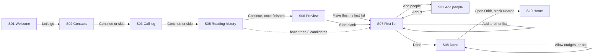
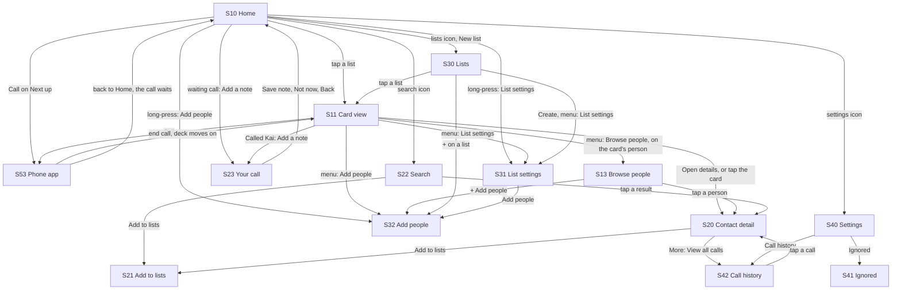
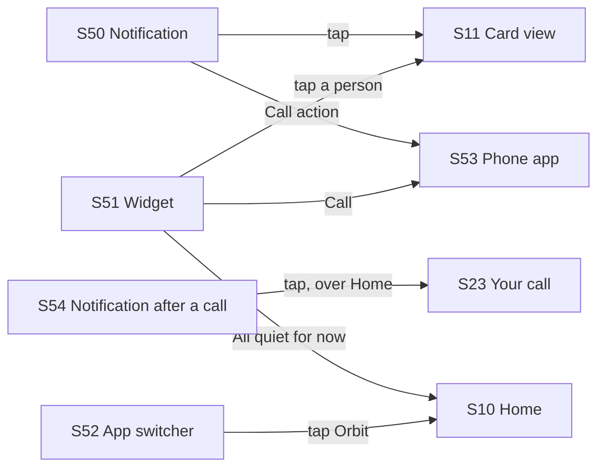

# Flows

> **Intent:** one place to see every screen and every journey through Orbit as it ships today, click through it like the real app, and leave feedback that names exactly which screen and state it is about. This is the review surface for changing the *flow*, not the visuals of any one screen.

**Prototype:** [`prototype/index.html`](prototype/index.html). One self-contained file; open it in any browser. No build step, no server.

**Published copy:** https://claude.ai/artifact/XVatbjrA7kJ2VzvvwkWimp (private to its owner until shared). Notes left there are saved to the page.

**Bugs found while building it:** [findings.md](findings.md) lists 14, from smart lists that never surface anyone to an indefinite pause that cannot be undone. All 14 were fixed on 2026-10-05 (B14 in part), and the prototype now shows the fixed behaviour. Each bug still shows on its screen in the prototype's side panel, marked fixed, with what changed.

**Built from:** the string resources (`android/app/src/main/res/values/strings_*.xml`) and the Compose source at commit `12df9c7` (2026-10-07), screen by screen; first built from `15b6bfb` (2026-10-04), re-derived on 2026-10-05, and re-derived again on 2026-10-07 after the app took the first round of the owner's review ([owner-review-2026-10-07.md](owner-review-2026-10-07.md)). Copy is verbatim from the strings. The 2026-10-07 pass shows:

- **List settings (S31) and Make your first list (S07):** the title is the rename control (LIST-26), "How often" for every list with a Late night list at its real 3 days (LIST-24), "Time of day" in place of active hours (LIST-25), and "Add people" in the People header (LIST-27). The Name section (on List settings), the Rhythm section and the Add people row at the foot are gone.
- **Lists (S30):** every row's second line is its interval ("Every 3 days"), never a rhythm's name.
- **Home (S10):** the calls waiting for a note (HOME-14, NOTE-05), one as a card, two or more as a pile, in place of the post-call banner.
- **The note page (S23, new):** "Your call with Kai" with a timer that counts up while it is open (NOTE-04).
- **The notification after a call (S54, new):** "How was your call with Kai?", which opens the note page (NOTIF-16).
- **Browse (S13):** one sequence in the card's order, each row saying when, then the Paused and Ignored groups (BROWSE-07); handles that really drag, with "Moved Kai earlier" and Undo (BROWSE-08); "On your card" on the card's person (BROWSE-09).
- **Card view (S11):** "Called Kai" with "Add a note", which opens the note page; "Browse people" opens Browse on the card's person.

The card and Browse share one order in the prototype too: Later, Sooner, a call and a drag each give the person a new next turn, so whatever one screen does, the other shows. The app has had no em dashes since 2026-10-05, so the prototype shows none.

*What the prototype does not yet show (as of 2026-10-07):* the owner's decisions that are not in the app yet (the Week screen, HOME-13; the card's swiping buttons, hints and "Log a connection", CARD-08 to CARD-10; the card opening the note page by itself after a call, CARD-11; the step-by-step New list flow, LIST-28 and LIST-29), so New list still uses the template sheet. Nor does it show TalkBack's "Move up" and "Move down" on Browse rows (the drag is pointer only here), the privacy curtain on the note page and the waiting calls (the prototype has no curtain toggle; S52 shows the curtain in the app switcher), a slider you can slide (How often steps through a few values on each tap), Contact detail's "Ignored" status line, the picker's "Select all" cap at 200, Settings' "Last synced 5 minutes ago" in minutes and hours, the Wallpaper swatch's real wallpaper hue, the gallery's exact spacing and type sizes, and any skeleton while a screen loads. Every demo call counts as 14 minutes, so it always waits for a note. It is a review surface for flows, not a pixel reference: the gallery renders in `vision/*/actual-*.png` are. Data is the synthetic cast from `android/scripts/seed-avd.py` plus a few invented address-book names. Nothing here is a real contact.

---

## How to use it

The prototype has four views, switched from the top bar:

| View | What it is for |
|---|---|
| **Prototype** | A phone you can tap through. Long-press works where the app has it (right-click also works). Swipe the card left or right. The panel on the right shows the screen's ID, every state you can open directly, where it leads, where it is reached from, what it owes the user, and any gap between the docs and the code. |
| **Flows** | Eleven journeys, step by step. The control to press next is outlined in blue. Use Next step, the arrow keys, or just tap the outlined control. |
| **Map** | Every screen at once, laid out by area, with where each one leads. Click any screen to open it. |
| **Feedback** | Every note you have left, grouped by journey and screen, with **Copy as markdown**. |

**Blue is the review layer.** Anything blue (tap-target outlines, flow cues, the feedback panel) is part of the review tool, never part of the app. The phone uses Orbit's own tokens from `design/colors_and_type.css`, in light or dark to match the page.

**Leaving feedback.** Every note records the screen ID, the state you were looking at, and a kind (Change, Question, or Works). In the Flows view you can attach a note to the whole journey instead of one screen. Where notes are kept depends on how you opened the prototype:

- **The published copy on claude.ai** saves notes to the page itself, so Claude can read them back and work through them.
- **This file opened locally** saves notes in that browser only. Use **Copy as markdown** on the Feedback view to move them anywhere.

Either way, the markdown export uses the IDs below, so a note like "S11, Ready: move Skip next to the arrows" is unambiguous.

---

## Screen inventory

IDs are stable handles for feedback. They are local to this document and the prototype; they are not requirement IDs.

### First run

| ID | Screen | Route | Spec |
|---|---|---|---|
| S01 | Welcome | `onboard/welcome` | [page view](../../features/page-views/onboarding-welcome.md) |
| S02 | Contacts permission | `onboard/permissions/contacts` | [page view](../../features/page-views/onboarding-permissions.md) |
| S03 | Call log permission | `onboard/permissions/call-log` | [page view](../../features/page-views/onboarding-permissions.md) |
| S04 | Notifications permission (legacy: out of the flow since ONB-30; kept only so a saved resume step lands) | `onboard/permissions/notifications` | [onboarding](../../features/onboarding/README.md) |
| S05 | Reading your call history | `onboard/sync` | [page view](../../features/page-views/onboarding-sync.md) |
| S06 | Preview your first list | `onboard/preview` | [page view](../../features/page-views/onboarding-preview.md) |
| S07 | Make your first list | `onboard/first-list/{listId}` | [page view](../../features/page-views/onboarding-first-list.md) |
| S08 | Done | `onboard/done` | [page view](../../features/page-views/onboarding-done.md) |

### Daily loop

| ID | Screen | Route | Spec |
|---|---|---|---|
| S10 | Home | `home` | [page view](../../features/page-views/home.md) |
| S11 | Card view | `card/{listId}` | [page view](../../features/page-views/card-view.md) |
| S13 | Browse people (the list in the card's order) | `browse/{listId}?focus={focus}` | [page view](../../features/page-views/browse.md) |

### People

| ID | Screen | Route | Spec |
|---|---|---|---|
| S20 | Contact detail | `contact/{contactId}` | [page view](../../features/page-views/contact-detail.md) |
| S21 | Add to lists (reverse picker) | `pick/lists` | [page view](../../features/page-views/picker-lists.md) |
| S22 | Search | `search` | [page view](../../features/page-views/search.md) |
| S23 | Your call (the post-call note page) | `note/{contactId}?callEventId={callEventId}` | [page view](../../features/page-views/post-call-note.md) |

### Lists

| ID | Screen | Route | Spec |
|---|---|---|---|
| S30 | Lists | `lists` | [page view](../../features/page-views/lists-manager.md) |
| S31 | List settings | `lists/{listId}/config` | [page view](../../features/page-views/list-config.md) |
| S32 | Add people (contact picker) | `pick/contacts` | [page view](../../features/page-views/picker-contacts.md) |

### Settings and records

| ID | Screen | Route | Spec |
|---|---|---|---|
| S40 | Settings | `settings` | [page view](../../features/page-views/settings.md) |
| S41 | Ignored | `settings/ignored` | [page view](../../features/page-views/ignored-contacts.md) |
| S42 | Call history | `call-log` | [page view](../../features/page-views/call-history.md) |

### Outside the app

| ID | Surface | Where | Spec |
|---|---|---|---|
| S50 | List nudge notification | lock screen, shade | [notifications](../../features/notifications/README.md) |
| S51 | Home screen widgets (2x2 and 4x2) | launcher | [widgets](../../features/widgets/README.md) |
| S52 | App switcher (privacy curtain) | recent apps | [privacy](../../features/privacy-and-lock/README.md) |
| S53 | Phone app | system dialer | [card view](../../features/card-view/README.md) |
| S54 | Notification after a call | lock screen, shade | [notifications](../../features/notifications/README.md) (NOTIF-16) |

Each screen's states (sheets, dialogs, menus, empty and error states) are listed in the prototype's right panel and can be opened directly. There are 133 in total.

---

## Flow maps

### First run



### Inside the app



### From outside the app



---

## Journeys

Each journey is playable in the Flows view. Order matters within a journey, so the steps are numbered.

**F1. First run, from install to Home.** Two permissions, a blocking sync, a suggested list, a required first list, then the nudge question on Done (ONB-30). The counter reads "1 of 4" to "4 of 4".
1. S01 Welcome: the Orbit mark settles into place (ONB-31), then Let's go.
2. S02 Contacts (1 of 4): the reason shows before Android's own dialog. Allow, or continue without it (a "Skip for now?" dialog confirms).
3. S03 Call log (2 of 4), same pattern. Notifications are not asked here any more.
4. S05 Reading your call history (3 of 4): Continue stays disabled until the read finishes.
5. S06 Preview (4 of 4): up to 10 people you already call, all ticked.
6. S07 Make your first list (4 of 4): a name field over the same controls as List settings (How often, Time of day, Nudges, People with "Add people" in its header); Done needs a name and at least 3 people.
7. S08 Done: the swipe hint, then "Want a gentle nudge when someone is worth a call?" with Allow nudges, asked once there is a list to nudge about; answered, it becomes a plain line. Open Orbit, then Home with the onboarding back stack cleared.

**F2. Call someone from a list.** The core loop.
1. S10 Home, tap a list card.
2. S11 Card view, Call.
3. S53 Phone app opens with the number filled in; you press call there.
4. End the call and come back: once the call log shows the call, S11 has moved past the person by itself and says "Called Kai" with "Add a note" (CARD-03), which opens S23.
5. Back to S10: the call waits for a note at the top, as one card, "You called Kai" with "Add a note" and "Dismiss" (HOME-14). It waits for a day, until a note is written or it is dismissed.
6. S23 the note page: "Your call with Kai", a timer counting up from 0:00 in the bar, the call in one line, one large field. "Save note" writes the note and returns to Home with "Note saved"; the call stops waiting.

**F3. Decide on the card: later, sooner, browse.** Swipe left or tap Later; swipe right or tap Sooner. Both buttons are named, there is no Skip, and each move shows a snackbar that names the person and says when they come back ("Kai will come up again on Thursday."), with its own Undo. Only the Call button dials; tapping the card opens details. The three-dots menu's "Browse people" opens S13 on the card's person, first and marked "On your card" (BROWSE-09). S13 is one sequence in the card's order, numbered, each row saying when ("Up now", "Tomorrow", "Thursday", "In 2 weeks"), then the Paused and Ignored groups (BROWSE-07); a drag handle moves someone earlier or later, with "Moved Theo earlier" and Undo, and the line under the order says a call, Later or Sooner moves people again (BROWSE-08). If no one is eligible, S11 says "All quiet for now." and offers Browse.

**F4. Start a new list.** S10 New list, S30 template sheet (each template names the rhythm it sets), Create, S31 List settings (saves as you go: the name is the title and renames in place, How often starts at the template's interval, Add people is in the People header), S32 Add people, back to S31 with "Added 3 people to Family", Done to S30. On S30 a row tap opens that list's cards (LIST-23); List settings is in the row menu, and every row's second line is its interval ("Every 14 days").

**F5. Tidy a list in bulk.** S13, long-press a row, Select, tap more rows, Move to which list, snackbar with Undo.

**F6. Find someone and file them.** S10 search icon, S22 type a name, Add to lists, S21 tick lists, back to S22 with "Added to 1 list".

**F7. Take a break from someone.** S20 More actions, Pause, pick a length (1 week, 1 month, Until you unpause; the same sheet Browse uses) with a snackbar and Undo. While paused, a line under the number says so and the menu offers Unpause. When a timed pause ends, S20 shows an unpause banner. Ignored people get back in from S41 under Settings with Unignore and Undo.

**F8. Look back at a call.** S10 Settings, S40 Call history, S42 tap a call, S20 opens with a note box under that call.

**F9. Nudged from outside the app.** S50 names the list's next person with their face and a Call action (NOTIF-14) and taps through to S11; on a locked phone that hides sensitive content it says only "Someone is ready when you are." (NOTIF-13). S51 widgets show the next person with a labelled Call: only Call opens S53, and a tap on the person opens their list's deck in Orbit (WIDGET-08). S52 shows "List" and "Someone" in the app switcher.

**F10. Back up, restore, or start over.** S40 Export (password twice), Import (password, then a final confirmation), Reset Orbit (restarts at S01).

**F11. Write about a call after it ends.** The notification after a call, the note page, and the calls waiting on Home (NOTE-04, NOTE-05, HOME-14, NOTIF-16).
1. S54: a call with Kai ended while Orbit was closed, so one notification asks "How was your call with Kai?" (on a locked phone that hides sensitive content, "How was your call?"). It is not a nudge: it has its own channel, "After a call".
2. S23 opens over Home. With words written, "Not now" asks "Discard this note?" ("Keep writing", "Discard"); "Save note" writes the note.
3. Back on S10 with "Note saved", two older calls still wait, stacked as a pile, "2 calls to write about". A tap opens it into one row per call with "Add a note" and "Dismiss", then "Dismiss all" ("Dismissed 2 calls", with Undo).

---

## Docs vs code

Reading the code against `features/PAGE_VIEWS.md` and the feature specs turned up fourteen gaps on 2026-10-04. Eleven were closed on 2026-10-05, by fixing the code (B2, B3, B7, B9, B11), by rewriting the page views to the shipped screens (Home, Welcome, List settings, Settings, widgets, notifications, copy without em dashes) or by deleting the page view for a screen that does not exist (the "Up next / Queue" page; its queue is part of S13 Browse, `features/browse/README.md` BROWSE-01). The last three closed when the 2026-10-06 packages merged: S20's "Ignored" and "Archived" status line shipped with the contact-detail package (`714fa8c`), S32's skip went with the pickers package (`3613c95`, the `onSkip` parameter no longer exists and [picker-contacts](../../features/page-views/picker-contacts.md) lists no skip), and S42's day headings and row menu are in [call-history](../../features/page-views/call-history.md) since the page-views package (`779f873`). Closed rows are deleted, as the rule below says, so no row is open. A new gap goes in a table here with the columns Where, The docs say, The code does.

---

## Feedback format

When writing feedback outside the prototype, lead with the ID and state so it can be acted on without a screenshot:

```
S11, Ready: the Later snackbar could name the weekday as well as "in 2 weeks".
F2, step 5: I expected a "Did you talk?" prompt before the deck moves on.
S30: the rhythm line under each list could show the nudge time too.
```

---

## Maintaining this

- **When a screen changes**, update its render function in `prototype/index.html` (each screen is one `screen({...})` block, in the same order as the inventory above), its row here, and any journey step that passes through it.
- **When a doc gap above is fixed** in `features/`, delete its row.
- **The prototype is a review tool, not a spec.** `features/` stays canonical for what the app should do; the code stays ground truth for what it does.
